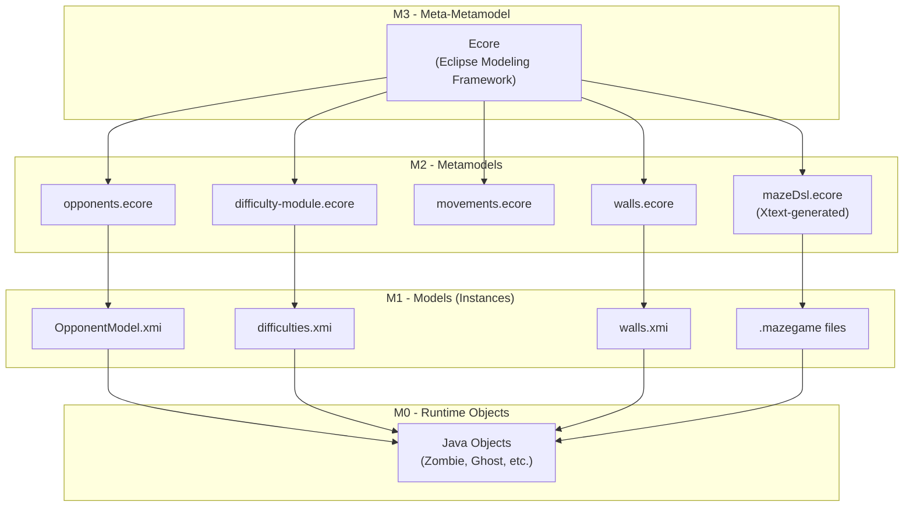
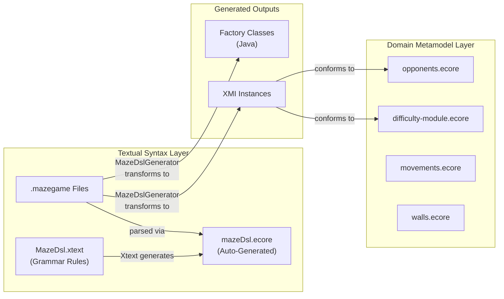
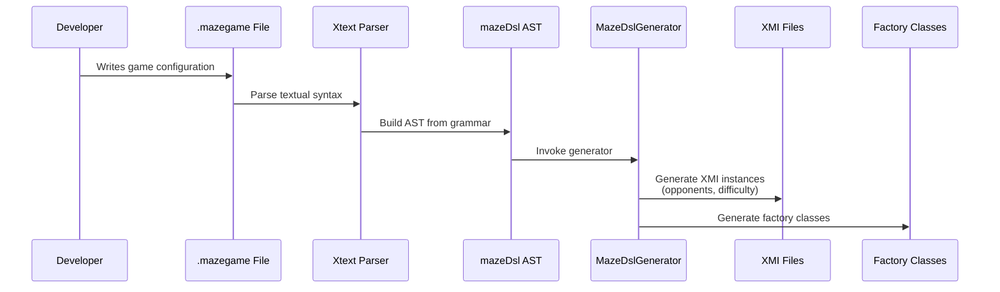
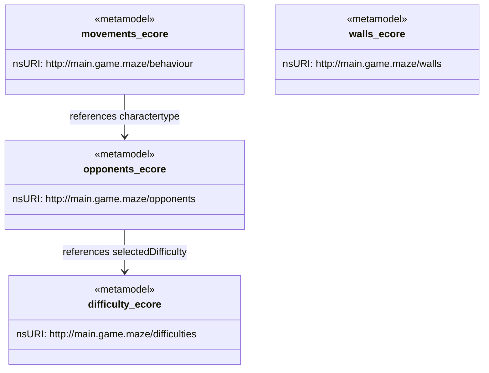
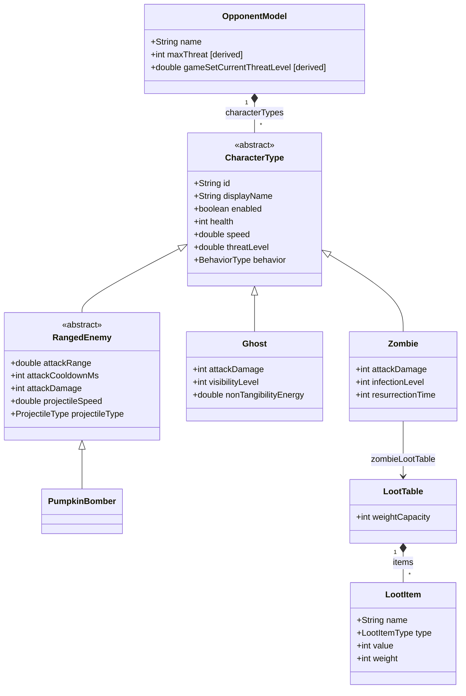
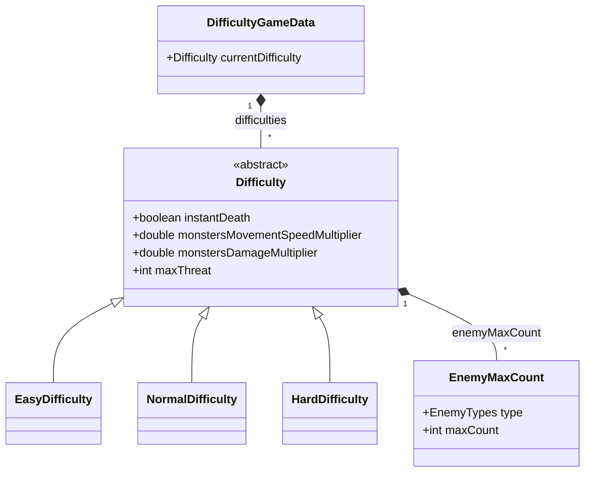
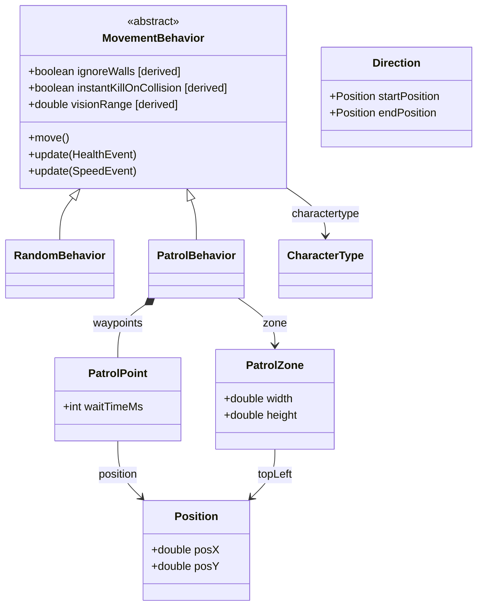
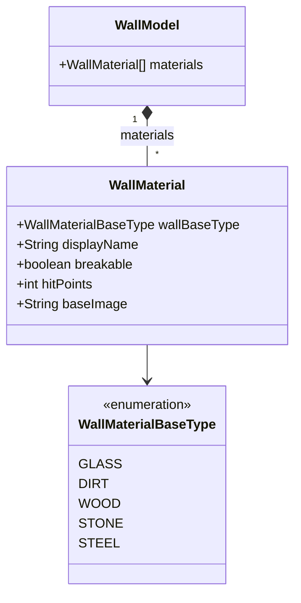
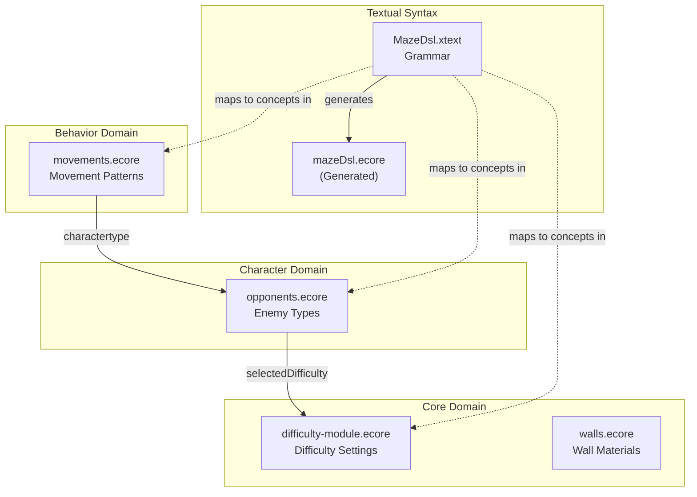
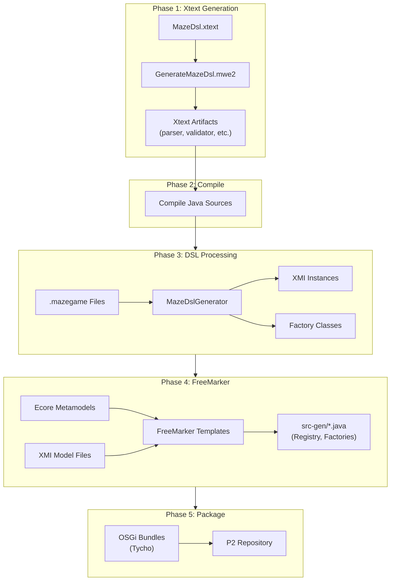

# Metamodel Architecture and Xtext Integration

This document explains how Xtext and Ecore metamodels work together in the MazeGame project, covering the architecture, relationships, and build flow.

## Table of Contents

- [Understanding Meta-Levels](#understanding-meta-levels)
- [How Xtext Fits In](#how-xtext-fits-in)
- [Domain Metamodels](#domain-metamodels)
- [Metamodel Relationships](#metamodel-relationships)
- [Build and Generation Flow](#build-and-generation-flow)
- [File Locations](#file-locations)

## Understanding Meta-Levels

Model-Driven Engineering (MDE) uses a layered approach to define domain concepts. This project follows the standard four-level architecture:



| Level | Name | Role | Examples in This Project |
|-------|------|------|--------------------------|
| **M3** | Meta-Metamodel | Defines how metamodels are structured | Ecore (from Eclipse EMF) |
| **M2** | Metamodel | Defines structure of domain models | `opponents.ecore`, `difficulty-module.ecore` |
| **M1** | Model | Instances conforming to a metamodel | `OpponentModel.xmi`, `.mazegame` files |
| **M0** | Runtime | Live objects in the running application | Java instances of `Zombie`, `Ghost` |

## How Xtext Fits In

Xtext provides a **textual concrete syntax** for defining game configurations. Rather than editing XML/XMI files directly, developers write human-readable `.mazegame` files.

### The Dual Metamodel Architecture

This project has two categories of metamodels working together:



**Category 1: Xtext-Generated Metamodel**

The `MazeDsl.xtext` grammar file defines the textual syntax. When Xtext processes it, it automatically generates a `mazeDsl.ecore` metamodel that represents the grammar structure.

**Category 2: Domain Metamodels**

The handcrafted `.ecore` files define the actual game domain concepts (opponents, difficulties, behaviors, walls). These are the "target" metamodels that the DSL ultimately populates.

### Transformation Flow



### Example: From DSL to Domain Model

**Input: tutorial.mazegame**
```
game TutorialLevel {
    difficulty {
        level easy
        maxThreat 30
        speedMultiplier 0.8
    }
    
    opponent TutorialZombie {
        type zombie
        displayName "Slow Zombie"
        health 50
        speed 0.5
        threatLevel 10
        behavior patrol
        
        zombie-stats {
            attackDamage 5
            infectionLevel 1
        }
    }
}
```

**Output: Generated XMI conforming to opponents.ecore**
```xml
<opp:OpponentModel name="TutorialLevel">
    <characterTypes xsi:type="opp:Zombie"
        id="TutorialZombie"
        displayName="Slow Zombie"
        health="50"
        speed="0.5"
        threatLevel="10"
        behavior="PATROL"
        attackDamage="5"
        infectionLevel="1"/>
</opp:OpponentModel>
```

## Domain Metamodels

### Overview

The project defines four domain metamodels, each in its own OSGi bundle:



### opponents.ecore

Defines enemy character types and their properties.



**OCL Constraints:**
- `validateMaxThreat`: Sum of character threat levels must not exceed `maxThreat`

### difficulty-module.ecore

Defines difficulty levels and their modifiers.



### movements.ecore

Defines movement behaviors and patrol patterns.



**OCL Constraints:**
- `ValidVisionRange`: For ranged enemies, attack range must not exceed vision range
- `PositivePositions`: Position coordinates must be non-negative

### walls.ecore

Defines wall materials and properties.



**OCL Constraints:**
- `ValidHitPoints`: Breakable walls must have hitPoints > 0; unbreakable walls must have hitPoints = 0

## Metamodel Relationships

The metamodels form a dependency graph through cross-references:



### Import Declarations in Ecore

**opponents.ecore imports:**
```xml
<eAnnotations source="http://www.eclipse.org/OCL/Import">
    <details key="diff" value="platform:/resource/main.game.maze.difficulties/..."/>
    <details key="ecore" value="http://www.eclipse.org/emf/2002/Ecore"/>
</eAnnotations>
```

**movements.ecore imports:**
```xml
<eAnnotations source="http://www.eclipse.org/OCL/Import">
    <details key="opp" value="...opponents.ecore#/"/>
    <details key="ecore" value="http://www.eclipse.org/emf/2002/Ecore"/>
</eAnnotations>
```

## Build and Generation Flow

### Complete Build Pipeline



### Maven Build Commands

```bash
# Step 1: Generate Xtext artifacts (requires Java 21)
mvn -f main.game.maze.dsl/pom.xml generate-sources -DskipTests

# Step 2: Full build with all modules
mvn -U clean verify
```

### MWE2 Workflow Configuration

The `GenerateMazeDsl.mwe2` file configures Xtext generation:

```
module main.game.maze.dsl.GenerateMazeDsl

Workflow {
    component = XtextGenerator {
        configuration = {
            project = StandardProjectConfig {
                baseName = "main.game.maze.dsl"
                runtimeTest = { enabled = true }
                eclipsePlugin = { enabled = true }
                genericIde = { enabled = true }
            }
        }
        language = StandardLanguage {
            name = "main.game.maze.dsl.MazeDsl"
            fileExtensions = "mazegame"
            validator = {
                composedCheck = "org.eclipse.xtext.validation.NamesAreUniqueValidator"
            }
        }
    }
}
```

## File Locations

### Metamodels (M2)

| Metamodel | Location |
|-----------|----------|
| opponents.ecore | `main.game.maze.opponents/src/main/resources/opponents.ecore` |
| difficulty-module.ecore | `main.game.maze.difficulties/src/main/resources/difficulty-module.ecore` |
| movements.ecore | `main.game.maze.behaviour/src/main/resources/movements/movements.ecore` |
| walls.ecore | `main.game.maze.walls/model/walls.ecore` |

### DSL Components

| Component | Location |
|-----------|----------|
| Grammar | `main.game.maze.dsl/src/main/java/main/game/maze/dsl/MazeDsl.xtext` |
| MWE2 Workflow | `main.game.maze.dsl/src/main/java/main/game/maze/dsl/GenerateMazeDsl.mwe2` |
| Generator | `main.game.maze.dsl/src/main/java/main/game/maze/dsl/generator/MazeDslGenerator.java` |
| Validator | `main.game.maze.dsl/src/main/java/main/game/maze/dsl/validation/MazeDslValidator.java` |

### Model Instances (M1)

| Model | Location |
|-------|----------|
| OpponentModel.xmi | `main.game.maze.opponents/src/main/resources/OpponentModel.xmi` |
| difficulties.xmi | `maze/src/main/resources/xmi/difficulties/difficulties.xmi` |
| walls.xmi | `main.game.maze.walls/xmi/walls.xmi` |
| DSL levels | `maze/src/main/resources/levels/*.mazegame` |

### Code Generation Templates

| Template Category | Location |
|-------------------|----------|
| Opponent templates | `maze-generator.acceleo/src/main/resources/templates/opponents/` |
| Wall templates | `maze-generator.acceleo/src/main/resources/templates/walls/` |

## Summary

This architecture provides:

1. **Separation of Concerns**: Domain metamodels are independent of the textual syntax
2. **Multiple Concrete Syntaxes**: XMI for tools, `.mazegame` for developers
3. **Validation at Multiple Levels**: OCL constraints in Ecore, custom validators in Xtext
4. **Extensibility**: New enemy types, behaviors, or difficulty levels can be added by extending the metamodels
5. **Code Generation**: Automated generation of boilerplate code from model definitions

The Xtext DSL serves as a developer-friendly entry point that ultimately populates the same domain models as direct XMI editing, but with syntax checking, content assist, and validation built into the editing experience.
