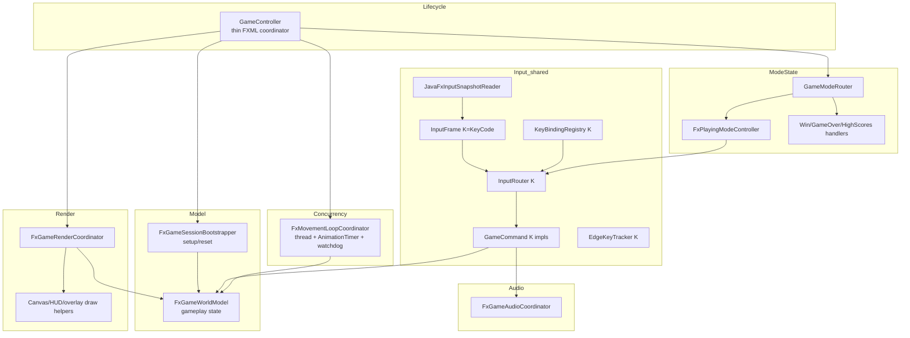

# JavaFX `GameController` Refactor Plan — MVC Decomposition + Command/Registry Input

**Status:** Proposed (not started)
**Branch (planned):** `feature/refactorJavafxForStandardImplementation`
**Scope:** JavaFX module only (`maze-javafx-backend`, `maze-javafx`); shared promotions into `maze-common-frontend`
**Date:** 2026-06-09
**Predecessor:** `docs/plans/libgdx-gamescreen-mvc-command-refactor.md` (the libGDX round establishes the reference architecture this plan mirrors)

---

## 0. Why this plan exists

The libGDX round (PR #61) introduced an MVC + Command/Registry input architecture for the
libGDX frontend. The JavaFX frontend was explicitly left out of scope that round
(libGDX plan §2 Non-Goals, §10 Follow-ups). As a result the two frontends are now
structurally asymmetric, which weakens CRR-5 (parity of *structure*, not only behavior).

`maze-javafx-backend/src/main/java/main/game/maze/GameController.java` is the JavaFX
counterpart of the old libGDX monolith and is currently the single largest class in the
repository.

| Aspect | libGDX (after refactor) | JavaFX `GameController` (today) |
|--------|-------------------------|---------------------------------|
| Size | ~794 lines (target `< 200`) | **1872 lines** |
| Input | `KeyBindingRegistry` + `InputRouter` + `GameCommand` | Inline `pressedKeys`, `handleKeyPressed/Released`, inline `switch` on `KeyCode` |
| Model | `GameWorldModel` boundary | Gameplay state fields owned directly by the controller |
| Render/View | `GdxGameRenderPipeline` + `Gdx*View` | Canvas drawing + node manipulation interleaved with logic |
| Mode routing | `GameModeRouter` + per-mode controllers | Implicit; no explicit mode state machine |
| Audio | `GdxGameAudioCoordinator` | Direct audio action calls |
| Lifecycle | `GameSessionBootstrapper` | `setupGame()` + thread/timer wiring inline |

This plan brings the JavaFX controller to the same layering and input model, and — where
the abstractions are genuinely backend-neutral — **promotes them into
`maze-common-frontend`** so both frontends share one input/mode core instead of two
parallel copies.

---

## 1. Motivation (concrete code smells)

From `GameController.java` (line references approximate, file is ~1872 lines):

- **God class / SRP violation (CRR-2, CRR-11):** a single `Initializable` controller owns
  FXML nodes, gameplay state, enemy AI service instances, scoring, path-hint budget math,
  camera follow, canvas drawing, a background `Task<Boolean>` movement thread, a movement
  `AnimationTimer`, multiple `Timeline`/`PauseTransition` timers, a movement watchdog, and
  terminal command handling.
- **Scattered input (CRR-16):** movement keys tracked in a `pressedKeys` `EnumSet`, action
  keys handled by an inline `switch (code)` in `handleKeyPressed`, release logic in
  `handleKeyReleased`. There is no open/closed extension point for a new key.
- **Concurrency coupling (CRR-12):** `runComputerCharactersThread`, `lastMovementLoopNanos`
  watchdog, and `AnimationTimer` lifecycles are interwoven with UI state, making headless
  testing of update logic very hard.
- **Duplication across frontends (CRR-16, CRR-5):** terminal command semantics, path-hint
  budget policy, scoring penalty accumulation, and mode transitions are conceptually the
  same as libGDX but implemented separately.
- **Long parameter / boolean-flag risk (CRR-15):** several private helpers thread booleans
  and timing primitives; the same telescoping risk SR-41 flags for libGDX.

These map to the same requirement failures the libGDX plan listed (CRR-1, CRR-2, CRR-11,
CRR-12, CRR-16, CRR-17).

---

## 2. Goals & Non-Goals

### Goals

- Reduce `GameController` to a **thin coordinator** that wires collaborators and forwards
  JavaFX lifecycle/FXML callbacks. Target **< 300 lines** for the JavaFX coordinator
  (a softer target than libGDX's `< 200` because FXML `@FXML` field declarations and JavaFX
  event-handler signatures impose unavoidable boilerplate).
- Introduce explicit **MVC layering**: Model (gameplay state), View (canvas/HUD/overlay
  rendering), Controller/Coordinator (lifecycle + wiring), per-mode state controllers.
- Introduce a **Command + Registry input system** for JavaFX, structurally identical to the
  libGDX one, driven by JavaFX `KeyCode` instead of libGDX `Input.Keys`.
- **Promote backend-neutral input/mode abstractions** into `maze-common-frontend` so both
  frontends consume one shared core (see §4).
- Preserve exact runtime behavior: no gameplay, visual, audio, or timing change.
- Keep all currently passing tests green; add headless unit tests for every new class.
- Update requirements docs (new SR-* entries), the RTM, and the JavaFX module readme.

### Non-Goals

- No gameplay feature changes, no new keys/commands beyond what already exists.
- No change to the enemy-AI movement services (`AntiLoopWanderMovementService`,
  `AdaptiveAggressiveMovementService`, `PatrolMovementService`, `GhostPhasingMovementService`),
  only how the controller consumes them.
- No rewrite of the FXML files or scene-graph structure beyond extracting wiring.
- No change to the threading model's *observable behavior* (the movement thread + watchdog
  stay; only their ownership moves to a dedicated collaborator).
- No libGDX changes except the optional promotion of shared abstractions (§4), done so that
  libGDX keeps compiling against the promoted types.

---

## 3. Constraints & Guardrails

- **Java 21** (CRR-6/7/8); autodetect SDK as already configured.
- **TDD** (WR-3, CRR-3/4): write/extend tests alongside each extraction.
- **MVC** (CRR-1) and **SOLID** (CRR-2) are the primary design drivers.
- **No hard-coded paths** (WR-21, CRR-19); reuse existing constants/services.
- **Branching** (WR-10): work on `feature/refactorJavafxForStandardImplementation`; never
  commit to `main`. This is a **separate PR** from the libGDX round.
- **JavaFX threading invariants MUST be preserved** (new, JavaFX-specific):
  - All scene-graph mutation stays on the JavaFX Application Thread (`Platform.runLater`
    where already used).
  - The background movement `Task<Boolean>` / `runComputerCharactersThread`, the movement
    `AnimationTimer`, the watchdog `Timeline`, the path-hint countdown `Timeline`, and
    `PauseTransition` timers must keep identical start/stop/dispose semantics. Extraction
    moves ownership but must not change thread affinity or lifecycle ordering.
  - `GameControllerDisposeTest` must stay green: disposal order and thread join timeout
    (`OPPONENT_THREAD_JOIN_TIMEOUT_MS`) behavior is a regression guard.
- **Terminal text input** semantics must not regress; reuse the shared
  `TerminalCommandParser` / `TerminalCommand` already in `maze-common-frontend`.
- **Preserve package-visible members that existing tests depend on** (or migrate them and
  update the referencing tests in the same commit). Known test touch-points:
  `GameControllerDisposeTest`, `GameControllerDifficultyBaseScoreTest`,
  `GameControllerScoringParityTest`, `GameControllerPathHintBudgetTest`,
  `GameControllerRoutePenaltyTest`, `GameControllerInfectionWarningTest`.

### Test commands

```powershell
# Build/verify JavaFX via the repo make script (autodetects Java 21)
pwsh ./make-javafx.ps1 quick

# Focused JavaFX backend module tests
mvn -pl maze-javafx-backend -am test -DskipITs

# Single test class
mvn -pl maze-javafx-backend -am test -DskipITs -Dtest=<TestClass> -Dsurefire.failIfNoSpecifiedTests=false

# Cross-frontend parity before final commit (both frontends + shared)
mvn -pl maze-common-frontend,maze-javafx-backend,maze-libgdx,maze -am test -DskipITs
```

---

## 4. Shared promotion strategy (`maze-common-frontend`)

The libGDX input abstractions are *almost* backend-neutral. They are parameterized today on
`int keyCode` (libGDX `Input.Keys`) and a libGDX-built `InputFrame`. The promotion
generalizes the **logical** layer and keeps the **physical key reading** per frontend.

**Promote (backend-neutral, move to `maze-common-frontend`):**

| Current libGDX type | Promoted shared type (`common.frontend.input`) | Notes |
|---------------------|-----------------------------------------------|-------|
| `input.GameAction` | `GameAction` | Pure enum; already neutral. |
| `input.KeyBindingRegistry` (+ `BindingKind`, `KeyBinding`) | `KeyBindingRegistry<K>` | Generify the key type `K` (libGDX `Integer`, JavaFX `KeyCode`). |
| `input.InputFrame` | `InputFrame<K>` interface | `isHeld(K)`, `isEdge(K)`, mouse x/y, click. Each frontend supplies a concrete snapshot. |
| `input.InputRouter` | `InputRouter<K>` | Resolves + executes commands; uses `stopRequested()`. |
| `input.command.GameCommand` | `GameCommand<K>` | `execute(GameCommandContext, InputFrame<K>)`. |
| `input.command.GameCommandContext` | `GameCommandContext` | Already a façade of callbacks; neutral. |
| `input.EdgeKeyTracker` | `EdgeKeyTracker<K>` | Rising-edge latch generalized on key type. |

**Keep per-frontend (physical layer):**

- libGDX: `InputSnapshotReader` (reads `Gdx.input`), `LibgdxInputCommandContext`, concrete
  commands, `GdxGameInputBindingsSupport` (binds `Input.Keys.*`).
- JavaFX: a new `JavaFxInputSnapshotReader` (reads a `pressedKeys` set + edge set maintained
  by the FXML key handlers), `JavaFxInputCommandContext`, concrete commands, and a
  `JavaFxInputBindingsSupport` (binds `KeyCode.*`).

**Migration safety:** Promotion is done as a dedicated first commit. libGDX is updated to
implement `InputFrame<Integer>` and consume the generified registry/router so libGDX tests
(`EdgeKeyTrackerTest`, `KeyBindingRegistryTest`, `InputRouterTest`) stay green with minimal
signature changes. If generics introduce churn risk, fall back to a non-generic shared core
keyed on a neutral `int` code with a JavaFX `KeyCode <-> int` adapter — decide in Phase 0
after a spike.

---

## 5. Existing assets to reuse (no behavioral change)

**Shared backend/services (consumed):** `ScoringEngine`, `PathHintBudget`,
`StatusMessageBus` (where applicable), `TerminalCommandParser`, `TerminalCommand`,
`MazeVisualStyleConfig`, the enemy-AI movement services, `GameAudioDirector`,
`HighScoreRepository`.

**JavaFX-specific (reused/wrapped):** `WinGameAction`, `GameOverAction`, `WinArea`,
`PlayerCharacter`, `GameMazeWorld`, canvas/draw helpers, FXML nodes.

---

## 6. Target architecture

### 6.1 Layering overview



### 6.2 New packages and classes (`main.game.maze.javafx.*` unless noted)

| Package | Class | Responsibility |
|---------|-------|----------------|
| `common.frontend.input` *(shared)* | `GameAction`, `KeyBindingRegistry<K>`, `InputFrame<K>`, `InputRouter<K>`, `EdgeKeyTracker<K>`, `command.GameCommand<K>`, `command.GameCommandContext` | Promoted neutral input core (§4). |
| `javafx.model` | `FxGameWorldModel` | Mutable gameplay state container (player char, maze, enemies, goal/win area, hp, path-hint budget state, route-penalty accumulators, debug-overlay flags). No FXML, no drawing. |
| `javafx.lifecycle` | `FxGameSessionBootstrapper` | Encapsulates `setupGame()`: arena/world build, player config load, board background, canvas setup, enemy spawn, controller/service resets. Keeps speed math. |
| `javafx.input` | `JavaFxInputSnapshotReader` | Builds an `InputFrame<KeyCode>` from the maintained held/edge key sets each tick. |
| `javafx.input` | `JavaFxInputBindingsSupport` | Registers `KeyCode.*` → `GameAction` and `GameAction` → command (EDGE/HELD). |
| `javafx.input.command` | `JavaFxInputCommandContext` | Façade exposing model, audio coordinator, navigation/high-score/terminal callbacks, dt. |
| `javafx.input.command` | `OpenTerminalCommand`, `ShowHighScoresCommand`, `ToggleSpanningTreeCommand`, `ApplyPathHintCommand`, `MovePlayerCommand`, `ReturnToMenuCommand` | One class per existing JavaFX action (parity with the key set in `handleKeyPressed`). |
| `javafx.controller.state` | `FxPlayingModeController` | The PLAYING update path: input routing, movement application, route-hint penalty, camera follow. |
| `javafx.controller.state` | (reuse shared) `GameModeRouter` | Deterministic mode dispatch (PLAYING / WON / GAME_OVER / HIGH_SCORES analog). |
| `javafx.render` | `FxGameRenderCoordinator` | Owns canvas/HUD/overlay redraw orchestration over an immutable render snapshot from `FxGameWorldModel`. |
| `javafx.concurrency` | `FxMovementLoopCoordinator` | Owns the movement `Task`/thread, the `AnimationTimer`, the watchdog `Timeline`, and their start/stop/dispose; exposes heartbeat. **Threading invariants live here.** |
| `javafx.audio` | `FxGameAudioCoordinator` | Wraps `GameAudioDirector` + `MazeVisualStyleConfig` (menu/in-game/win/game-over transitions). |
| `javafx.input` | `JavaFxPathHintInputController` | Edge/held handling for the `P` path-hint budget (press-start/clear), delegating budget math to shared `PathHintBudget`. |

> Where a libGDX overlay/mode controller has a JavaFX equivalent action (high scores, win,
> game over), adapt it to the shared `GameModeController` contract so the router treats all
> modes uniformly, exactly as the libGDX plan did.

---

## 7. Phased execution

Each phase is independently committable, keeps the build green, and changes no behavior.
Run `pwsh ./make-javafx.ps1 quick` plus the focused module tests after **every** phase, and
a manual smoke run after Phases 3 and 5.

### Phase 0 — Shared promotion spike

- Generify and move the neutral input core into `common.frontend.input` (§4).
- Update libGDX to consume the promoted types; keep `EdgeKeyTrackerTest`,
  `KeyBindingRegistryTest`, `InputRouterTest` green (adjust imports/signatures only).
- **Decision gate:** if generics churn is high, switch to the neutral-`int` + `KeyCode`
  adapter fallback before proceeding.
- **Tests:** existing libGDX input tests + new `KeyBindingRegistryGenericsTest`.

### Phase 1 — Model extraction

- Add `FxGameWorldModel`; move gameplay state fields out of `GameController` with minimal
  mutators/getters.
- Add `FxGameSessionBootstrapper`; extract `setupGame()` build/reset logic (keep behavior).
- **Tests:** `FxGameWorldModelTest`, `FxGameSessionBootstrapperTest` (headless; verify state
  init, difficulty wiring, enemy count, resets). Keep
  `GameControllerDifficultyBaseScoreTest` green.

### Phase 2 — Concurrency coordinator extraction (JavaFX-specific, highest risk)

- Add `FxMovementLoopCoordinator`; move the movement `Task`/thread, `AnimationTimer`,
  watchdog `Timeline`, and their start/stop/dispose into it. The controller delegates
  start/stop/dispose and receives heartbeats via callback.
- **Invariant:** identical thread affinity, join timeout, and disposal ordering.
- **Tests:** `FxMovementLoopCoordinatorTest` (lifecycle start/stop/dispose, watchdog
  threshold logic where headless-feasible). Keep `GameControllerDisposeTest` green — this is
  the primary regression guard for this phase.

### Phase 3 — Command + Registry input system (JavaFX)

- Add `JavaFxInputSnapshotReader`, `JavaFxInputBindingsSupport`,
  `JavaFxInputCommandContext`, and one `GameCommand<KeyCode>` per existing action
  (H, ESC, P, O, terminal, movement).
- Rewire `handleKeyPressed`/`handleKeyReleased` to maintain held/edge key sets only; routing
  runs through the shared `InputRouter<KeyCode>`.
- Keep terminal text entry behavior via existing dialog/`TerminalCommandParser`.
- **Tests:** `JavaFxInputBindingsSupportTest`, per-command tests, and a router-integration
  test asserting H/ESC/P/O/terminal/movement behave identically to the pre-refactor switch.

### Phase 4 — Per-mode state machine + render/audio coordinators

- Add `FxPlayingModeController`, adopt the shared `GameModeRouter`, add
  `FxGameRenderCoordinator` and `FxGameAudioCoordinator`.
- Move route-hint penalty, camera follow, and redraw orchestration into the playing
  controller / render coordinator.
- **Tests:** `FxPlayingModeControllerTest`, `FxGameRenderCoordinatorTest` (snapshot assembly
  where headless-feasible), `FxGameAudioCoordinatorTest`. Keep
  `GameControllerScoringParityTest`, `GameControllerRoutePenaltyTest`,
  `GameControllerPathHintBudgetTest`, `GameControllerInfectionWarningTest` green.

### Phase 5 — Slim coordinator + docs/requirements/RTM

- Reduce `GameController` to lifecycle + FXML callbacks + wiring (target **< 300 lines**).
- `docs/requirements-features/suggested-requirements.md`: add SR entries (§8).
- `docs/requirements-features/requirements-traceability-matrix.md`: one row per new SR
  mapping requirement → class → test.
- `maze-javafx/readme.md` (or `maze-javafx-backend/readme.md`): document the JavaFX MVC
  layering, the shared input core, and the threading-ownership boundary.
- Append the WR/CRR/DOD status table (DOD-1) to the work summary.

---

## 8. New requirements (to be added in Phase 5)

> Numbering continues after SR-41 (last existing). Adjust if other SRs land first.

| ID | Requirement | Implementation | Test |
|----|-------------|----------------|------|
| SR-42 | The Command + key-binding registry input core shall be shared in `maze-common-frontend` and consumed by both frontends; new keys/actions are added without modifying the dispatch loop. | promoted `common.frontend.input` core | `KeyBindingRegistryGenericsTest`, existing libGDX input tests, `JavaFxInputBindingsSupportTest` |
| SR-43 | JavaFX gameplay input shall be handled via the shared key-binding registry resolving to command objects, replacing the inline `handleKeyPressed` switch. | `JavaFxInputSnapshotReader`, `JavaFxInputBindingsSupport`, JavaFX `GameCommand` impls | per-command tests, router-integration test |
| SR-44 | JavaFX gameplay state shall live in a dedicated model separate from lifecycle/rendering/input. | `FxGameWorldModel` | `FxGameWorldModelTest` |
| SR-45 | JavaFX session start/reset shall be encapsulated in a bootstrapper. | `FxGameSessionBootstrapper` | `FxGameSessionBootstrapperTest` |
| SR-46 | JavaFX movement thread, animation timer, and watchdog shall be owned by a dedicated concurrency coordinator with unchanged lifecycle semantics. | `FxMovementLoopCoordinator` | `FxMovementLoopCoordinatorTest`, `GameControllerDisposeTest` |
| SR-47 | JavaFX per-mode update logic shall be dispatched by a state-machine router. | shared `GameModeRouter`, `FxPlayingModeController` | `FxPlayingModeControllerTest` |
| SR-48 | JavaFX frame rendering shall be orchestrated by a dedicated render coordinator consuming an immutable snapshot. | `FxGameRenderCoordinator` | `FxGameRenderCoordinatorTest` + existing layout/parity guards |
| SR-49 | JavaFX audio transitions shall be encapsulated behind a coordinator over `GameAudioDirector`. | `FxGameAudioCoordinator` | `FxGameAudioCoordinatorTest` |

---

## 9. Verification plan

1. `pwsh ./make-javafx.ps1 quick` green after **each** phase.
2. `mvn -pl maze-javafx-backend -am test -DskipITs` green after each phase; the six existing
   `GameController*Test` classes are non-negotiable regression guards.
3. New headless unit tests per §7.
4. Cross-frontend parity before final commit:
   `mvn -pl maze-common-frontend,maze-javafx-backend,maze-libgdx,maze -am test -DskipITs`.
5. Manual smoke (`make-javafx.ps1 -Target prepare-run`): play Easy; movement (WASD/arrows);
   `/h` terminal help; `P` path hint (and budget exhaustion); `O` spanning-tree overlay;
   `H` high scores; `ESC` difficulty picker/restart; complete win flow; trigger game-over
   flow; confirm parity with pre-refactor behavior and no thread leak on exit.
6. Confirm coordinator line count **< 300**; no new class exceeds ~300 lines.

---

## 10. Risks & mitigations

| Risk | Mitigation |
|------|------------|
| JavaFX threading regression (movement thread, watchdog, timers). | Isolate all of it in `FxMovementLoopCoordinator`; keep `GameControllerDisposeTest` green; do this extraction in its own phase (Phase 2) with no other changes. |
| Scene-graph mutation off the FX thread. | Keep all node mutation behind existing `Platform.runLater` boundaries; coordinators only compute, the controller applies on the FX thread. |
| Shared generics churn breaks libGDX. | Phase 0 spike with a decision gate; neutral-`int` + `KeyCode` adapter fallback. |
| Tests reference controller-private members. | Keep or migrate them and update referencing tests in the same commit. |
| Terminal OS-layout / text entry regresses. | Reuse the existing JavaFX dialog + shared `TerminalCommandParser`; only edge/held/movement move to the registry. |
| Behavioral drift during extraction. | One concern per phase; build + focused tests green each step; manual smoke after Phases 3 and 5. |
| Scope creep into gameplay/FXML. | Non-Goals (§2) are explicit; no FXML/scene rewrite; no AI-service changes. |

---

## 11. Follow-ups (out of scope this round)

- If both frontends fully converge, consider moving the per-frontend snapshot readers behind
  a shared `InputSnapshotReader<K>` interface in `maze-common-frontend`.
- Evaluate sharing a common `RenderSnapshot` contract once both render coordinators consume
  immutable snapshots.
- Revisit whether `FxMovementLoopCoordinator` and the libGDX update loop can expose a shared
  scheduling abstraction (likely not worthwhile given JavaFX `AnimationTimer` vs libGDX
  render loop differences — defer until proven).
