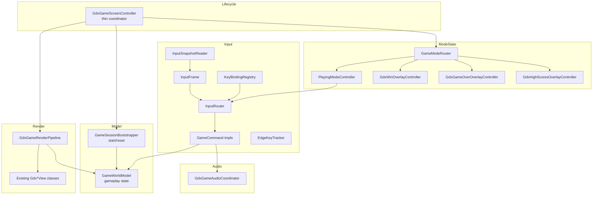

# libGDX `GdxGameScreenController` Refactor Plan — MVC Decomposition + Command/Registry Input

**Status:** In Progress (partially completed)
**Branch:** `feature/refactorLibgdxForStandardImplementation`
**Scope:** libGDX module only this round 
**Date:** 2026-06-06
**Last Updated:** 2026-06-09

## 0. Execution Status Log

### Completed

1. Command plus registry input boundary was implemented with `InputSnapshotReader`, `InputFrame`, `KeyBindingRegistry`, `InputRouter`, and command implementations.
2. Mode routing was extracted with `GameModeRouter`, `PlayingModeController`, `LibgdxPlayingBridge`, and overlay coordination classes.
3. Render orchestration was extracted with `GdxGameRenderPipeline` and state assembly support.
4. Startup flow extraction was implemented with `GameSessionStartFlowCoordinator` and related bootstrap and start collaborators.
5. Runtime helper extractions were implemented for layout, interaction, and runtime math responsibilities.
6. Parity compatibility seams were preserved or restored where reflection based tests required them.
7. Requirements traceability updates were applied in `docs/requirements-features/requirements-traceability-matrix.md`.

### Phase Completion Markers

| Phase | Title | Status |
|-------|-------|--------|
| Phase 1 | Model extraction (`GameWorldModel`, `GameSessionBootstrapper`) | Done (with `GameWorldModelTest`, `GameSessionBootstrapperTest`) |
| Phase 2 | Render pipeline (`GdxGameRenderPipeline` + coordinator) | Done (with `GdxGameRenderPipelineTest` over pure decision helpers) |
| Phase 3 | Command + registry input system | Done (with `EdgeKeyTrackerTest`, `KeyBindingRegistryTest`, `InputRouterTest`) |
| Phase 4 | Per-mode state machine + slim coordinator | Partial — router/`PlayingModeController`/`GdxGameAudioCoordinator` done; coordinator still above `< 200` lines |
| Phase 5 | Documentation, requirements, RTM | Done — SR-35..41 in suggested-requirements, RTM rows updated, readmes refreshed |

### Pending

1. Final target for a thin coordinator is not yet reached; `GdxGameScreenController` remains above the `< 200` line target (current: ~662 lines). This is the single largest outstanding item, and reaching `< 200` is an aggressive goal that requires several further behavior-preserving increments.
2. Follow-up structural cleanup is still needed before this plan can be marked fully completed.

### Architecture Note (screen router)

Since this plan was first written, screen routing was introduced: `GdxGame` (libGDX `Game`
root) now routes between `MenuScreenController`, `PlayingModeController`, and a
`LegacyPlayScreenController` that hosts `GdxGameScreenController`. The original assumption
that `GdxGameScreenController` is the sole lifecycle root no longer holds; it is now the
legacy gameplay host being decomposed behind that router.

### Validation Snapshot

1. Full repository `mvn test` run under Java 21 completed with `BUILD SUCCESS`.
2. Focused libGDX regression suites used during extraction rounds are green.

### 2026-06-09 Increment (render-constants extraction)

1. Extracted the render-only tuning values (wall thickness, player alive/dead scale, half ratio, infection-overlay geometry, top margin, score-panel sizing) into a dedicated `render.GdxGameRenderConstants` factory that builds the `GdxGameRenderCoordinator.RenderConstants` block; bar heights are sourced from `GdxGameScreenMetrics` so HUD geometry stays single-defined.
2. Replaced the inline ~16-argument `RenderConstants` construction in the controller's canonical constructor with a single `GdxGameRenderConstants.defaults()` call.
3. Removed the now-unused `StageConstants` import from the controller.
4. Added `GdxGameRenderConstantsTest` (2 tests) asserting the exact tuning values and that bar heights come from the shared metrics (no visual change).
5. `make-libgdx.ps1 quick` is green: `BUILD SUCCESS`, 237 tests, 0 failures.
6. Controller line count after this increment: 662 (down from 690).

### 2026-06-09 Increment (layout/metrics extraction)

1. Extracted the controller's pure layout/metrics helpers into a dedicated, stateless `controller.GdxGameScreenMetrics` class (SRP / MVC): `computeGameStripBounds`, `hpBarBottomY`, `bottomRowY`, `bottomRowHeight`, `bottomBarHeight`, `hpBarHeight`, `deathDisplayDelaySeconds`, `isInfectious`, `toJavaFxLikeSpeed`, plus the `GameStripBounds` record.
2. Moved the frame-independent constants `JAVA_FX_TICK_RATE`, `BOTTOM_BAR_HEIGHT`, `HP_BAR_HEIGHT`, and `DEATH_DISPLAY_DELAY_SECONDS` onto the metrics class and updated the controller's internal call sites to reference them there.
3. Removed the now-unused `EnemySpawn` import from the controller.
4. Repointed the existing `GdxGameScreenLayoutTest` and `GdxGameScreenParityTest` assertions at `GdxGameScreenMetrics`; those suites now serve as the metrics class tests (no behavior change, pure relocation).
5. `make-libgdx.ps1 quick` is green: `BUILD SUCCESS`, 235 tests, 0 failures.
6. Controller line count after this increment: 690 (down from 794).

### 2026-06-08 Increment (ten micro-steps)

1. `create()` split into focused initialization helpers for graphics resources, cameras/overlays, resize-to-window, and optional auto-start.
2. `render()` now uses `clampedFrameDelta()` helper for frame-time clamping.
3. `applyStartFlow(...)` split into `applyStartState(...)`, `ensureViewportInitialized(...)`, `applyRuntimeTextures(...)`, and `flashStartedDifficulty(...)`.
4. Return-to-menu compatibility fallback moved into `returnToMenuFallback(...)`.
5. `dispose()` now delegates graphics cleanup to `disposeGraphicsResources(...)`.
6. `updateFrameState(...)` now delegates terminal command execution to `executePendingTerminalCommand(...)`.
7. `updateFrameState(...)` now delegates transient overlay ticking to `tickTransientOverlayState(...)`.
8. `draw()` now delegates render-state construction via `buildRenderAssemblyInput()`.
9. Compile and focused libGDX tests remained green after each batch.
10. Controller remains behavior-compatible, but the `< 200` line objective is still pending.

### 2026-06-08 Increment (collaborator extraction follow-up)

1. Terminal typing control-key handling was moved from `GdxGameScreenController` into `GdxGameInteractionSupport.handleTerminalTypingInput(...)`.
2. `LibgdxPlayingBridge` wiring now invokes the interaction helper directly for terminal typing behavior.
3. Controller mode update flow now delegates through `updateByMode(...)` to keep `update(...)` orchestration thinner.
4. Overlay mode routing now uses controller-local `currentScore()` helper for consistent score reads.
5. Render assembly now uses `currentScore()` helper to avoid duplicated score computation call sites.
6. Difficulty status text now uses `difficultyLabel(...)` helper to reduce inline formatting logic.
7. Removed obsolete controller-local `handleTerminalTypingInput()` implementation after helper migration.
8. Compile and focused libGDX tests remained green.

### 2026-06-08 Increment (expanded orchestration cleanup)

1. Input binding registration split into `bindMenuAndOverlayActions()` and `bindMovementActions()`.
2. Win overlay high-score transition extracted to `openHighScoresFromWin()`.
3. Frame-state update split into `readInputFrame()` and `tickHudInteraction(...)` helpers.
4. Movement flow split into `resolveMovementIntent()`, `canApplyMovement(...)`, and `applyMovementIntent(...)`.
5. Death-sequence flow split into `ensureDeathSequenceStarted()`, `transitionToGameOverIfNeeded()`, and `playGameOverSoundOnce()`.
6. Difficulty selection split into `selectedDifficulty()`.
7. Arena construction callback extracted to `buildArenaForSelectedDifficulty(...)`.
8. All compile and focused libGDX tests remained green.
9. Important outcome: controller line count increased after this batch due internal method extraction.
10. Next required direction: move logic to dedicated collaborators/classes rather than adding more controller-local helper methods.

### 2026-06-08 Increment (lifecycle collaborator extraction)

1. Added `GdxGameLifecycleSupport` as a dedicated lifecycle collaborator for graphics and overlay resource setup/disposal.
2. `create()` in `GdxGameScreenController` now delegates resource creation and overlay resource loading to the new collaborator.
3. `dispose()` in `GdxGameScreenController` now delegates graphics cleanup to the new collaborator.
4. Removed controller-local lifecycle helper methods that were replaced by collaborator calls.
5. Compile and focused libGDX tests remained green after the extraction.
6. Controller line count reduced compared to previous increment.

### 2026-06-08 Increment (start-flow apply collaborator extraction)

1. Added `GdxGameStartFlowApplySupport` to own start-state unpacking, viewport initialization, runtime texture mapping, and started-difficulty status text formatting.
2. `GdxGameScreenController.applyStartFlow(...)` now delegates these concerns to the new collaborator.
3. Removed controller-local start-flow apply helper methods that became redundant (`applyStartState`, `ensureViewportInitialized`, `applyRuntimeTextures`, `flashStartedDifficulty`, `difficultyLabel`).
4. Compile and focused libGDX tests remained green.
5. Controller line count reduced again after this extraction.

### 2026-06-08 Increment (input and frame-state collaborators)

1. Added `GdxGameInputBindingsSupport` and moved all key-binding plus command registration out of the controller.
2. Added `GdxGameFrameStateSupport` and moved frame-state responsibilities (input snapshot polling, HUD tick, pending terminal command execution, debug/status ticking) out of the controller.
3. `GdxGameScreenController` now delegates `configureInputBindings()` and `updateFrameState(...)` to these collaborators.
4. Removed redundant controller-local binding and frame-state helper methods after migration.
5. Compile and focused libGDX tests remained green.
6. Full repository `mvn test` under Java 21 remained green after this extraction.

### 2026-06-08 Increment (update-flow collaborator extraction)

1. Added `GdxGameUpdateFlowSupport` and moved movement-from-input flow out of `GdxGameScreenController`.
2. Added death-sequence flow handling in the same collaborator, including delayed transition to game-over and one-time game-over music trigger.
3. `GdxGameScreenController.applyMovementFromFrame(...)` and `applyDeathSequence(...)` now delegate to the collaborator.
4. Removed redundant controller-local helper methods for movement/death flow that became unnecessary after extraction.
5. Compile and focused libGDX tests remained green.
6. Full repository `mvn test` under Java 21 remained green with `BUILD SUCCESS`.
7. Controller line count reduced to 847 in this increment.

### 2026-06-08 Increment (render coordinator extraction)

1. Added `render.GdxGameRenderCoordinator` to own render-state snapshot assembly orchestration on top of the existing pipeline and assembler.
2. `GdxGameScreenController.draw()` now delegates render-state construction and pipeline invocation to the new coordinator.
3. Removed the large controller-local `buildRenderAssemblyInput()` method after migrating that mapping logic.
4. Updated the libGDX module readme to describe the new render coordinator boundary.
5. Added `GdxGamePlayingBridgeFactory` to own `LibgdxPlayingBridge` construction wiring.
6. Added `GdxGameStartFlowRequestFactory` to own `StartFlowRequest` construction wiring.
7. `make-libgdx.ps1 quick` completed successfully after migration fixes.
8. Controller line count after this increment: 811.

### 2026-06-08 Increment (render coordinator rewire after external edits)

1. Rewired `GdxGameScreenController` to delegate draw-state mapping through `render.GdxGameRenderCoordinator`.
2. Removed the controller-local `buildRenderAssemblyInput()` block again after it reappeared during external file edits.
3. Preserved existing render behavior by keeping `GdxGameRenderStateAssembler` and `GdxGameRenderPipeline` usage inside the coordinator.
4. Validation run `pwsh ./make-libgdx.ps1 quick` completed with `BUILD SUCCESS`.
5. Controller line count after this increment: 794.

### 2026-06-08 Increment (combat/enemy/win support extraction)

1. Added `helper.GdxGameCombatAndEnemyFlowSupport` to own enemy advance, combat frame projection, and win trigger transition checks.
2. `GdxGameScreenController` now delegates `advanceEnemies(...)`, `updateCombat(...)`, `shouldTriggerWin()`, and `triggerWin()` to the new support class.
3. During this increment, one intermediate patch corrupted controller method boundaries; this was repaired in the same increment and revalidated.
4. Validation run `pwsh ./make-libgdx.ps1 quick` completed with `BUILD SUCCESS` after the repair.
5. Controller line count after this increment: 776.

### 2026-06-08 Increment (start-flow apply orchestration extraction)

1. Extended `GdxGameStartFlowApplySupport` with a single `apply(...)` orchestration entrypoint that now handles difficulty window resize, viewport init and bounds update, goal recentering, session mode switch, in-game music transition, difficulty status message, and camera follow update.
2. `GdxGameScreenController.applyStartFlow(...)` now delegates the orchestration through the helper and only maps the returned applied state to controller fields.
3. Validation run `pwsh ./make-libgdx.ps1 quick` completed with `BUILD SUCCESS`.
4. Controller line count after this increment: 776 (no net reduction in this micro-step, but responsibility moved out of the controller method body).

### 2026-06-08 Increment (mouse interaction coordinator extraction)

1. Added `helper.GdxGameMouseInteractionCoordinator` to encapsulate gameplay mouse interaction wiring using live state suppliers.
2. `GdxGameScreenController` now wires `playingBridge` mouse handling through `mouseInteractionCoordinator::handle`.
3. Removed controller-local `handleGameMouseInput(...)` method after migration.
4. Validation run `pwsh ./make-libgdx.ps1 quick` completed with `BUILD SUCCESS`.
5. Controller line count after this increment: 771.

### 2026-06-09 Increment (missing collaborator tests + render decision extraction)

1. Added `GdxGameAudioCoordinatorTest` (SR-40) using a recording `IAudioEngine` fake to assert in-game/win/game-over/menu music routing and `stopAll` channel coverage.
2. Added `GameSessionBootstrapperTest` (SR-39) using the production `RuntimeVisualModelLoader` with a provided maze, asserting runtime-state computation plus session, world-model, and collaborator resets.
3. Extracted two pure, package-private static decisions in `GdxGameRenderPipeline` (`hasRenderableWorld(...)`, `isHighScoresOnlyOverlay(...)`) so the GL-bound `render(...)` routing logic becomes headless-testable; behavior unchanged.
4. Added `GdxGameRenderPipelineTest` (SR-37) covering those decision helpers.
5. Updated the requirements traceability matrix rows SR-36..40 from "planned" to the implemented collaborators and added SR-41 (telescoping-constructor code smell).
6. Validation run `pwsh ./make-libgdx.ps1 quick` completed with `BUILD SUCCESS`; libGDX suite at 229 tests green.

### 2026-06-09 Increment (SR-41 telescoping-constructor removal)

1. Added `controller.GdxGameScreenOptions` (immutable parameter object plus fluent builder) carrying arena, cell size, real-maze flag, asset service ownership, auto/immediate start, high-scores shortcut, return-to-menu action, and forced difficulty.
2. Replaced the `GdxGameScreenController` telescoping-constructor chain (eleven overloads ending in four consecutive boolean flags) with a single canonical `GdxGameScreenController(GdxGameScreenOptions)` constructor plus a no-arg convenience and the `forHighScores` factory, both delegating through the options builder.
3. Removed the now-dead `DEFAULT_CELL_SIZE`, `DEFAULT_COLS`, `DEFAULT_ROWS`, and `DEFAULT_PLAYER_SPEED` constants that only fed the old overloads (the latter three were never even stored on the instance).
4. Updated all call sites to the builder: `PlayScreenController`, `LegacyPlayScreenController`, `GdxDifficultyPropagationTest` (via a shared helper), and `GdxScoringAndSpawnParityTest`.
5. Added `GdxGameScreenOptionsTest` (6 tests) covering builder defaults, asset-service supply/retention, runtime-config copy, explicit-flag retention, and controller forced-difficulty propagation.
6. Updated suggested-requirements SR-41 wording and the RTM SR-41 row from "planned" to the implemented `GdxGameScreenOptions` boundary.
7. Validation run `pwsh ./make-libgdx.ps1 quick` completed with `BUILD SUCCESS`; libGDX suite green (now 235 tests).

---

## 1. Motivation

`maze-libgdx/src/main/java/main/game/maze/libgdx/controller/GdxGameScreenController.java`
is a ~920-line monolith that mixes many unrelated concerns in one class:

- libGDX lifecycle (`create`, `resize`, `render`, `dispose`) and GL resource ownership
  (`SpriteBatch`, `ShapeRenderer`, `BitmapFont`, cameras, viewport, textures).
- Gameplay **state** (maze, player, enemies, goal position/size, HP/tint/infection,
  death-sequence timers, path-hint budget, score penalty).
- **Input** polling — ~17 scattered `Gdx.input.*` call sites for edge keys (T/H/O/ESC),
  held movement (WASD/arrows), and mouse hit-testing — interleaved inside `update()`.
- The **update loop** (movement, enemy advance, combat, win check, camera follow).
- The **draw loop** (world view, HUD, four overlays, infection warning).
- **Session bootstrap** (`startGameFromSelection`, arena build, window resize, goal nudge,
  enemy spawn loop).
- **Audio** transitions and **scoring**/high-score wiring.

This violates several repository code-review requirements:

| Requirement | Issue |
|-------------|-------|
| CRR-1 (MVC) | Controller owns model state and rendering calls directly. |
| CRR-2 (SOLID) | Single class has many reasons to change; not open/closed for new input actions. |
| CRR-11 (modularity) | Concerns not separated into focused classes. |
| CRR-12 (testability) | Update/draw/input logic is hard to exercise headlessly. |
| CRR-16 (DRY) | Input polling and mode checks duplicated across methods. |
| CRR-17 (KISS) | A single method graph spans the whole game loop. |

### Why a Command + Registry pattern for input (opinion)

I recommend it. Input is currently a scattered set of `Gdx.input` calls mixing
edge-triggered keys, held movement, and mouse hit-testing inline in `update()`.
A **key-binding registry that resolves to `GameCommand` objects** makes the input
system *open/closed* (CRR-2): a new key or action is added by registering a binding,
without editing the central dispatch loop. Each action becomes an independently
unit-testable, headless `GameCommand` (CRR-12/CRR-14), and the duplication of polling
plus `if (session.mode() == ...)` checks disappears (CRR-16).

The codebase already has good seeds for this:

- `GdxModeInputController` — an edge-trigger latch (`consumeEsc/H/O/T`).
- `GdxPlayerInputController.resolveMovement(...)` — a pure key-state → `MovementIntent` converter.

The plan generalizes the latch into a reusable `EdgeKeyTracker` and wraps actions as
`GameCommand`s behind a `KeyBindingRegistry` + `InputRouter`.

---

## 2. Goals & Non-Goals

### Goals

- Reduce `GdxGameScreenController` to a thin coordinator (target **< 200 lines**) that only
  wires collaborators and forwards libGDX lifecycle callbacks.
- Introduce clear MVC layering: **Model** (state), **View** (existing render classes),
  **Controller/Coordinator** (lifecycle + wiring), **per-mode state controllers**.
- Introduce a **Command + Registry** input system replacing scattered `Gdx.input` polling.
- Preserve exact runtime behavior (no gameplay or visual change).
- Keep all currently passing tests green; add new headless unit tests for every new class.
- Update requirements docs (SR-* entries), the RTM, and the libGDX module readme.
- Use subfolders under maze-libgdx\src\main\java\main\game\maze\libgdx

### Non-Goals

- No JavaFX `GameController` refactor at all. CRR-5 parity is **preserved** because no
  new gameplay is introduced; the equivalent JavaFX restructuring is not now.
- No new gameplay features, no new keys/commands beyond what already exists.
- No changes to shared movement/scoring/session services beyond consuming them.

---

## 3. Constraints & Guardrails

- **Java 21** (CRR-6/7/8); autodetect SDK as already configured.
- **TDD** (WR-3, CRR-3/4): write/extend tests alongside each extraction.
- **MVC** (CRR-1) and **SOLID** (CRR-2) are the primary design drivers.
- **No hard-coded paths** (WR-21, CRR-19); reuse existing constants/services.
- **Branching** (WR-10): stay on `feature/refactorLibgdxForStandardImplementation`; never commit to `main`.
- **Terminal text input** MUST remain on `InputProcessor.keyTyped(char)` so the OS-localized
  keyboard layout produces correct characters (æ, ø, å, accented). `ENTER`/`BACKSPACE`/`ESC`
  remain polled control keys. (Repo build-note; do not regress.)
- **Preserve package-private statics that tests depend on** (or migrate them and update the
  referencing tests in the same commit):
  `computeGameStripBounds`, the `GameStripBounds` record, `hpBarBottomY`, `bottomRowY`,
  `bottomRowHeight`, `bottomBarHeight`, `hpBarHeight`, `deathDisplayDelaySeconds`,
  `isInfectious`, `terminalHelpText`, `parseTerminalCommand`, `toJavaFxLikeSpeed`.

### Test commands

```powershell
# Focused per-phase regression
mvn -pl maze,maze-libgdx,main.game.maze.mazeworld -am test -DskipITs

# Single test class within the Tycho reactor
mvn -pl maze-libgdx -am test -DskipITs -Dtest=<TestClass> -Dsurefire.failIfNoSpecifiedTests=false

# Broader cross-frontend parity (before final commit)
mvn -pl maze-common-frontend,maze-javafx,maze,maze-libgdx -am test -DskipITs
```

---

## 4. Existing Assets to Reuse (no behavioral change)

**Views (unchanged):** `GdxGameWorldView`, `GdxHudView`, `GdxWinOverlayView`,
`GdxGameOverOverlayView`, `GdxHighScoresOverlayView`, `GdxInfectionOverlayView`.

**Sub-controllers (reused/wrapped):** `GdxModeInputController`, `GdxPlayerInputController`,
`GdxTerminalController`, `GdxHudInteractionStateController`, `GdxWinOverlayController`,
`GdxGameOverOverlayController`, `GdxHighScoresOverlayController`.

**Helpers/support (reused):** `GdxTerminalCommandSupport`, `GdxScoreSupport`,
`GdxDebugOverlayState`, `GdxVisualStyleSupport`, `DifficultyBoardConfig`, `GdxAssetService`.

**Shared backend (consumed):** `GameSession`, `GameMode`, `StatusMessageBus`,
`ScoringEngine`, `EnemyDirectorService`, `GameAudioDirector`, `PathHintBudget`,
`HighScoreRepository`, `WorldView` / `GdxWorldView`.

---

## 5. Target Architecture

### 5.1 Layering overview



### 5.2 New packages and classes

| Package | Class | Responsibility |
|---------|-------|----------------|
| `libgdx.model` | `GameWorldModel` | Mutable gameplay state container (maze, player, runtimeModel, enemies, goal, hp/tint/infection, death timers, path-hint budget, score penalty, active path points). No `Gdx.input`, no rendering. |
| `libgdx.lifecycle` | `GameSessionBootstrapper` | Builds/resets a `GameWorldModel` for a chosen `Difficulty`: arena build, runtime-model load, spawn loop, window resize, goal recenter/nudge, controller resets. Keeps `toJavaFxLikeSpeed` math. |
| `libgdx.render` | `GdxGameRenderPipeline` | Owns `draw()` orchestration over existing views via an immutable render snapshot. |
| `libgdx.input` | `InputFrame` (record) | Per-frame immutable snapshot: held keys, edge keys, mouse x/y, click state. |
| `libgdx.input` | `InputSnapshotReader` | Reads `Gdx.input` exactly once per frame to build an `InputFrame`. |
| `libgdx.input` | `EdgeKeyTracker` | Generic rising-edge latch generalizing `GdxModeInputController`. |
| `libgdx.input.command` | `GameCommand` (interface) | `void execute(GameCommandContext ctx)`. |
| `libgdx.input.command` | `GameCommandContext` | Facade exposing session, world model, audio coordinator, status bus, terminal controller, navigation callbacks, dt. |
| `libgdx.input.command` | `OpenTerminalCommand`, `ToggleTerminalCommand`, `ShowHighScoresCommand`, `ToggleSpanningTreeCommand`, `TogglePathHintCommand`, `MovePlayerCommand`, `ReturnToMenuCommand` | One class per existing action. |
| `libgdx.input` | `KeyBindingRegistry` | Maps logical action → `GameCommand` and key(s) → action; supports `EDGE` and `HELD` binding kinds. Open/closed for new bindings. |
| `libgdx.input` | `InputRouter` | `route(InputFrame, ctx)`: evaluate bindings and execute matching commands. |
| `libgdx.controller.state` | `GameModeController` (interface) | `update(float dt)` + `boolean handled()` contract for a mode. |
| `libgdx.controller.state` | `GameModeRouter` | Dispatches `update(dt)` by `GameMode` to the right `GameModeController`. |
| `libgdx.controller.state` | `PlayingModeController` | The `PLAYING` update logic: input routing, movement, enemy advance, combat, win check, camera follow, path penalty/hint. |
| `libgdx.audio` | `GdxGameAudioCoordinator` | Wraps `GameAudioDirector` + `MazeVisualStyleConfig` (in-game/menu/win/game-over music, menu-music resolution). |

> Existing overlay controllers (`GdxWinOverlayController`, `GdxGameOverOverlayController`,
> `GdxHighScoresOverlayController`) are adapted to the `GameModeController` interface so the
> router can treat all modes uniformly.

---

## 6. Phased Execution

Each phase is independently committable, keeps the build green, and changes no behavior.

### Phase 1 — Model extraction

**Add**
- `model/GameWorldModel` — move all gameplay state fields out of the controller, with
  minimal mutators/getters.
- `lifecycle/GameSessionBootstrapper` — extract `startGameFromSelection`,
  `buildArenaForDifficulty`, `resizeWindowForDifficulty`, `recenterGoalLikeJavaFx`,
  `nudgeGoalOffWalls`, and the enemy spawn loop. Keep `toJavaFxLikeSpeed` static.

**Tests:** `GameWorldModelTest`, `GameSessionBootstrapperTest` (headless; verify state
initialization, difficulty wiring, enemy count, goal centering).

**Verify:** existing `GdxGameScreen*` tests stay green; no behavior change.

### Phase 2 — Render pipeline

**Add**
- `render/GdxGameRenderPipeline` — move `draw()` orchestration: build `EnemyViewModel`
  list, call `GdxGameWorldView`, `applyFullWindowGlViewport`, `drawHud`, and the four overlay
  draws + infection warning, fed by an immutable render snapshot sourced from
  `GameWorldModel` + `GameSession` + controllers.

**Decision:** keep the static layout helpers (`computeGameStripBounds`, `hpBarBottomY`, …)
where tests reference them, or move them into the pipeline and update those tests in the
same commit.

**Tests:** reuse existing layout/strip tests; add `GdxGameRenderPipelineTest` for snapshot
assembly where headless-feasible.

**Verify:** visual parity via manual smoke run + tests.

### Phase 3 — Command + Registry input system

**Add** `input/` package as listed in §5.2:
- `InputFrame`, `InputSnapshotReader`, `EdgeKeyTracker`.
- `command/GameCommand`, `command/GameCommandContext`, and one concrete command per action.
- `KeyBindingRegistry`, `InputRouter`.

**Keep:** terminal `keyTyped` on the `InputProcessor` (OS layout). Mouse HUD hit-testing
stays in a small `MouseInputController` or a click `GameCommand` using `HudLayout`.

**Tests:** `EdgeKeyTrackerTest`, `KeyBindingRegistryTest`, `InputRouterTest`, and per-command
tests (all pure/headless). Assert movement, terminal-toggle, mode-key, and overlay-entry
behavior is identical to the pre-refactor controller.

**Verify:** focused regression green; manual key-by-key smoke.

### Phase 4 — Per-mode state machine + slim coordinator

**Add**
- `controller/state/GameModeController` (interface) and `GameModeRouter`.
- `controller/state/PlayingModeController` — the `PLAYING` branch of `update(dt)`.
- `audio/GdxGameAudioCoordinator` — wrap `GameAudioDirector` + `visualStyle`.

**Adapt:** `GdxHighScoresOverlayController`, `GdxWinOverlayController`,
`GdxGameOverOverlayController` to `GameModeController`.

**Modify:** `GdxGameScreenController` → thin coordinator: `create`/`resize`/`render`/`dispose`
plus wiring (bootstrap model, build registry, build render pipeline, build mode router).
Target **< 200 lines**. Keep required package-private statics delegating to new homes.

**Tests:** `GameModeRouterTest`, `PlayingModeControllerTest`, `GdxGameAudioCoordinatorTest`.

**Verify:** focused + broader parity runs green.

### Phase 5 — Documentation, requirements, RTM

- `docs/requirements-features/suggested-requirements.md`: add
  - **SR-35** Command + key-binding registry input system (libGDX).
  - **SR-36** `GameWorldModel` gameplay-state boundary.
  - **SR-37** Render-pipeline boundary (`GdxGameRenderPipeline`).
  - **SR-38** `GameMode` state-machine router.
  - **SR-39** `GameSessionBootstrapper` session start/reset boundary.
  - **SR-40** `GdxGameAudioCoordinator` audio boundary.
- `docs/requirements-features/requirements-traceability-matrix.md`: add a row per SR mapping
  requirement → new class → test.
- `maze-libgdx/readme.md`: document the new input command system and MVC layering.
- Append the WR/CRR/DOD status table (DOD-1) to the work summary.

---

## 7. New Requirements (to be added in Phase 5)

| ID | Requirement | Implementation | Test |
|----|-------------|----------------|------|
| SR-35 | libGDX input shall be handled via a key-binding registry resolving to `GameCommand` objects; new keys/actions added without modifying the dispatch loop. | `KeyBindingRegistry`, `InputRouter`, `GameCommand` impls, `EdgeKeyTracker`, `InputFrame`, `InputSnapshotReader` | `KeyBindingRegistryTest`, `InputRouterTest`, `EdgeKeyTrackerTest`, per-command tests |
| SR-36 | Gameplay state shall live in a dedicated model separate from lifecycle/rendering/input. | `GameWorldModel` | `GameWorldModelTest` |
| SR-37 | Frame rendering shall be orchestrated by a dedicated render pipeline consuming an immutable snapshot. | `GdxGameRenderPipeline` | `GdxGameRenderPipelineTest` + existing layout tests |
| SR-38 | Per-`GameMode` update logic shall be dispatched by a state-machine router. | `GameModeRouter`, `PlayingModeController`, adapted overlay controllers | `GameModeRouterTest`, `PlayingModeControllerTest` |
| SR-39 | Game session start/reset shall be encapsulated in a bootstrapper. | `GameSessionBootstrapper` | `GameSessionBootstrapperTest` |
| SR-40 | libGDX audio transitions shall be encapsulated behind a coordinator over `GameAudioDirector`. | `GdxGameAudioCoordinator` | `GdxGameAudioCoordinatorTest` |

---

## 8. Verification Plan

1. `mvn -pl maze,maze-libgdx,main.game.maze.mazeworld -am test -DskipITs` green after **each** phase.
2. New headless unit tests: `EdgeKeyTrackerTest`, `KeyBindingRegistryTest`, `InputRouterTest`,
   per-command tests, `GameWorldModelTest`, `GameSessionBootstrapperTest`,
   `GameModeRouterTest`, `PlayingModeControllerTest`, `GdxGameAudioCoordinatorTest`.
3. Broader parity: `mvn -pl maze-common-frontend,maze-javafx,maze,maze-libgdx -am test -DskipITs`
   before the final commit.
4. Manual smoke (`make-libgdx.ps1 -Target prepare-run`): play Easy; `/h` terminal help;
   `P` path hint; `O` spanning-tree overlay; `H` high scores; `ESC` to menu; complete win flow;
   trigger game-over flow. Confirm parity with pre-refactor behavior.
5. Confirm coordinator line count **< 200**; no new class exceeds ~300 lines.

---

## 9. Risks & Mitigations

| Risk | Mitigation |
|------|------------|
| Tests reference package-private statics on the monolith. | Keep statics (delegating) or migrate + update referencing tests in the same commit. |
| Terminal OS-layout input regresses. | Leave `InputProcessor.keyTyped` untouched; only edge/held/mouse move to the registry. |
| Behavioral drift during extraction. | One concern per phase; keep build green each step; manual smoke after Phases 3 and 4. |
| Hidden coupling via shared mutable state. | Route all state through `GameWorldModel`; commands mutate only via `GameCommandContext`. |
| CRR-5 parity concern. | No gameplay change; JavaFX equivalent tracked as an explicit follow-up requirement. |

---

## 10. Follow-ups (out of scope this round)

- Apply the equivalent MVC + Command/registry input restructuring to the JavaFX
  `GameController` to restore symmetric internal structure (CRR-5 parity of *structure*,
  not just behavior).
- Consider promoting the `GameCommand`/`KeyBindingRegistry` abstractions into
  `maze-common-frontend` if both frontends converge on them.
