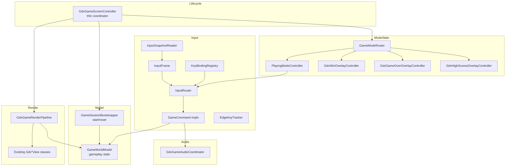

# libGDX `GdxGameScreenController` Refactor Plan — MVC Decomposition + Command/Registry Input

**Status:** Proposed
**Branch:** `feature/refactorLibgdxForStandardImplementation`
**Scope:** libGDX module only this round (JavaFX `GameController` is a documented follow-up).
**Date:** 2026-06-06

---

## 1. Motivation

`maze-libgdx/src/main/java/main/game/maze/libgdx/controller/GdxGameScreenController.java`
is a ~920-line monolith that mixes many unrelated concerns in one class:

- libGDX lifecycle (`create`, `resize`, `render`, `dispose`) and GL resource ownership
  (`SpriteBatch`, `ShapeRenderer`, `BitmapFont`, cameras, viewport, textures).
- Gameplay **state** (maze, player, enemies, goal position/size, HP/tint/infection,
  death-sequence timers, path-hint budget, score penalty).
- **Input** polling — ~17 scattered `Gdx.input.*` call sites for edge keys (T/H/O/ESC),
  held movement (WASD/arrows), and mouse hit-testing — interleaved inside `update()`.
- The **update loop** (movement, enemy advance, combat, win check, camera follow).
- The **draw loop** (world view, HUD, four overlays, infection warning).
- **Session bootstrap** (`startGameFromSelection`, arena build, window resize, goal nudge,
  enemy spawn loop).
- **Audio** transitions and **scoring**/high-score wiring.

This violates several repository code-review requirements:

| Requirement | Issue |
|-------------|-------|
| CRR-1 (MVC) | Controller owns model state and rendering calls directly. |
| CRR-2 (SOLID) | Single class has many reasons to change; not open/closed for new input actions. |
| CRR-11 (modularity) | Concerns not separated into focused classes. |
| CRR-12 (testability) | Update/draw/input logic is hard to exercise headlessly. |
| CRR-16 (DRY) | Input polling and mode checks duplicated across methods. |
| CRR-17 (KISS) | A single method graph spans the whole game loop. |

### Why a Command + Registry pattern for input (opinion)

I recommend it. Input is currently a scattered set of `Gdx.input` calls mixing
edge-triggered keys, held movement, and mouse hit-testing inline in `update()`.
A **key-binding registry that resolves to `GameCommand` objects** makes the input
system *open/closed* (CRR-2): a new key or action is added by registering a binding,
without editing the central dispatch loop. Each action becomes an independently
unit-testable, headless `GameCommand` (CRR-12/CRR-14), and the duplication of polling
plus `if (session.mode() == ...)` checks disappears (CRR-16).

The codebase already has good seeds for this:

- `GdxModeInputController` — an edge-trigger latch (`consumeEsc/H/O/T`).
- `GdxPlayerInputController.resolveMovement(...)` — a pure key-state → `MovementIntent` converter.

The plan generalizes the latch into a reusable `EdgeKeyTracker` and wraps actions as
`GameCommand`s behind a `KeyBindingRegistry` + `InputRouter`.

---

## 2. Goals & Non-Goals

### Goals

- Reduce `GdxGameScreenController` to a thin coordinator (target **< 200 lines**) that only
  wires collaborators and forwards libGDX lifecycle callbacks.
- Introduce clear MVC layering: **Model** (state), **View** (existing render classes),
  **Controller/Coordinator** (lifecycle + wiring), **per-mode state controllers**.
- Introduce a **Command + Registry** input system replacing scattered `Gdx.input` polling.
- Preserve exact runtime behavior (no gameplay or visual change).
- Keep all currently passing tests green; add new headless unit tests for every new class.
- Update requirements docs (SR-* entries), the RTM, and the libGDX module readme.

### Non-Goals

- No JavaFX `GameController` refactor this round. CRR-5 parity is **preserved** because no
  new gameplay is introduced; the equivalent JavaFX restructuring is tracked as a follow-up.
- No new gameplay features, no new keys/commands beyond what already exists.
- No changes to shared movement/scoring/session services beyond consuming them.

---

## 3. Constraints & Guardrails

- **Java 21** (CRR-6/7/8); autodetect SDK as already configured.
- **TDD** (WR-3, CRR-3/4): write/extend tests alongside each extraction.
- **MVC** (CRR-1) and **SOLID** (CRR-2) are the primary design drivers.
- **No hard-coded paths** (WR-21, CRR-19); reuse existing constants/services.
- **Branching** (WR-10): stay on `feature/refactorLibgdxForStandardImplementation`; never commit to `main`.
- **Terminal text input** MUST remain on `InputProcessor.keyTyped(char)` so the OS-localized
  keyboard layout produces correct characters (æ, ø, å, accented). `ENTER`/`BACKSPACE`/`ESC`
  remain polled control keys. (Repo build-note; do not regress.)
- **Preserve package-private statics that tests depend on** (or migrate them and update the
  referencing tests in the same commit):
  `computeGameStripBounds`, the `GameStripBounds` record, `hpBarBottomY`, `bottomRowY`,
  `bottomRowHeight`, `bottomBarHeight`, `hpBarHeight`, `deathDisplayDelaySeconds`,
  `isInfectious`, `terminalHelpText`, `parseTerminalCommand`, `toJavaFxLikeSpeed`.

### Test commands

```powershell
# Focused per-phase regression
mvn -pl maze,maze-libgdx,main.game.maze.mazeworld -am test -DskipITs

# Single test class within the Tycho reactor
mvn -pl maze-libgdx -am test -DskipITs -Dtest=<TestClass> -Dsurefire.failIfNoSpecifiedTests=false

# Broader cross-frontend parity (before final commit)
mvn -pl maze-common-frontend,maze-javafx,maze,maze-libgdx -am test -DskipITs
```

---

## 4. Existing Assets to Reuse (no behavioral change)

**Views (unchanged):** `GdxGameWorldView`, `GdxHudView`, `GdxWinOverlayView`,
`GdxGameOverOverlayView`, `GdxHighScoresOverlayView`, `GdxInfectionOverlayView`.

**Sub-controllers (reused/wrapped):** `GdxModeInputController`, `GdxPlayerInputController`,
`GdxTerminalController`, `GdxHudInteractionStateController`, `GdxWinOverlayController`,
`GdxGameOverOverlayController`, `GdxHighScoresOverlayController`.

**Helpers/support (reused):** `GdxTerminalCommandSupport`, `GdxScoreSupport`,
`GdxDebugOverlayState`, `GdxVisualStyleSupport`, `DifficultyBoardConfig`, `GdxAssetService`.

**Shared backend (consumed):** `GameSession`, `GameMode`, `StatusMessageBus`,
`ScoringEngine`, `EnemyDirectorService`, `GameAudioDirector`, `PathHintBudget`,
`HighScoreRepository`, `WorldView` / `GdxWorldView`.

---

## 5. Target Architecture

### 5.1 Layering overview



### 5.2 New packages and classes

| Package | Class | Responsibility |
|---------|-------|----------------|
| `libgdx.model` | `GameWorldModel` | Mutable gameplay state container (maze, player, runtimeModel, enemies, goal, hp/tint/infection, death timers, path-hint budget, score penalty, active path points). No `Gdx.input`, no rendering. |
| `libgdx.lifecycle` | `GameSessionBootstrapper` | Builds/resets a `GameWorldModel` for a chosen `Difficulty`: arena build, runtime-model load, spawn loop, window resize, goal recenter/nudge, controller resets. Keeps `toJavaFxLikeSpeed` math. |
| `libgdx.render` | `GdxGameRenderPipeline` | Owns `draw()` orchestration over existing views via an immutable render snapshot. |
| `libgdx.input` | `InputFrame` (record) | Per-frame immutable snapshot: held keys, edge keys, mouse x/y, click state. |
| `libgdx.input` | `InputSnapshotReader` | Reads `Gdx.input` exactly once per frame to build an `InputFrame`. |
| `libgdx.input` | `EdgeKeyTracker` | Generic rising-edge latch generalizing `GdxModeInputController`. |
| `libgdx.input.command` | `GameCommand` (interface) | `void execute(GameCommandContext ctx)`. |
| `libgdx.input.command` | `GameCommandContext` | Facade exposing session, world model, audio coordinator, status bus, terminal controller, navigation callbacks, dt. |
| `libgdx.input.command` | `OpenTerminalCommand`, `ToggleTerminalCommand`, `ShowHighScoresCommand`, `ToggleSpanningTreeCommand`, `TogglePathHintCommand`, `MovePlayerCommand`, `ReturnToMenuCommand` | One class per existing action. |
| `libgdx.input` | `KeyBindingRegistry` | Maps logical action → `GameCommand` and key(s) → action; supports `EDGE` and `HELD` binding kinds. Open/closed for new bindings. |
| `libgdx.input` | `InputRouter` | `route(InputFrame, ctx)`: evaluate bindings and execute matching commands. |
| `libgdx.controller.state` | `GameModeController` (interface) | `update(float dt)` + `boolean handled()` contract for a mode. |
| `libgdx.controller.state` | `GameModeRouter` | Dispatches `update(dt)` by `GameMode` to the right `GameModeController`. |
| `libgdx.controller.state` | `PlayingModeController` | The `PLAYING` update logic: input routing, movement, enemy advance, combat, win check, camera follow, path penalty/hint. |
| `libgdx.audio` | `GdxGameAudioCoordinator` | Wraps `GameAudioDirector` + `MazeVisualStyleConfig` (in-game/menu/win/game-over music, menu-music resolution). |

> Existing overlay controllers (`GdxWinOverlayController`, `GdxGameOverOverlayController`,
> `GdxHighScoresOverlayController`) are adapted to the `GameModeController` interface so the
> router can treat all modes uniformly.

---

## 6. Phased Execution

Each phase is independently committable, keeps the build green, and changes no behavior.

### Phase 1 — Model extraction

**Add**
- `model/GameWorldModel` — move all gameplay state fields out of the controller, with
  minimal mutators/getters.
- `lifecycle/GameSessionBootstrapper` — extract `startGameFromSelection`,
  `buildArenaForDifficulty`, `resizeWindowForDifficulty`, `recenterGoalLikeJavaFx`,
  `nudgeGoalOffWalls`, and the enemy spawn loop. Keep `toJavaFxLikeSpeed` static.

**Tests:** `GameWorldModelTest`, `GameSessionBootstrapperTest` (headless; verify state
initialization, difficulty wiring, enemy count, goal centering).

**Verify:** existing `GdxGameScreen*` tests stay green; no behavior change.

### Phase 2 — Render pipeline

**Add**
- `render/GdxGameRenderPipeline` — move `draw()` orchestration: build `EnemyViewModel`
  list, call `GdxGameWorldView`, `applyFullWindowGlViewport`, `drawHud`, and the four overlay
  draws + infection warning, fed by an immutable render snapshot sourced from
  `GameWorldModel` + `GameSession` + controllers.

**Decision:** keep the static layout helpers (`computeGameStripBounds`, `hpBarBottomY`, …)
where tests reference them, or move them into the pipeline and update those tests in the
same commit.

**Tests:** reuse existing layout/strip tests; add `GdxGameRenderPipelineTest` for snapshot
assembly where headless-feasible.

**Verify:** visual parity via manual smoke run + tests.

### Phase 3 — Command + Registry input system

**Add** `input/` package as listed in §5.2:
- `InputFrame`, `InputSnapshotReader`, `EdgeKeyTracker`.
- `command/GameCommand`, `command/GameCommandContext`, and one concrete command per action.
- `KeyBindingRegistry`, `InputRouter`.

**Keep:** terminal `keyTyped` on the `InputProcessor` (OS layout). Mouse HUD hit-testing
stays in a small `MouseInputController` or a click `GameCommand` using `HudLayout`.

**Tests:** `EdgeKeyTrackerTest`, `KeyBindingRegistryTest`, `InputRouterTest`, and per-command
tests (all pure/headless). Assert movement, terminal-toggle, mode-key, and overlay-entry
behavior is identical to the pre-refactor controller.

**Verify:** focused regression green; manual key-by-key smoke.

### Phase 4 — Per-mode state machine + slim coordinator

**Add**
- `controller/state/GameModeController` (interface) and `GameModeRouter`.
- `controller/state/PlayingModeController` — the `PLAYING` branch of `update(dt)`.
- `audio/GdxGameAudioCoordinator` — wrap `GameAudioDirector` + `visualStyle`.

**Adapt:** `GdxHighScoresOverlayController`, `GdxWinOverlayController`,
`GdxGameOverOverlayController` to `GameModeController`.

**Modify:** `GdxGameScreenController` → thin coordinator: `create`/`resize`/`render`/`dispose`
plus wiring (bootstrap model, build registry, build render pipeline, build mode router).
Target **< 200 lines**. Keep required package-private statics delegating to new homes.

**Tests:** `GameModeRouterTest`, `PlayingModeControllerTest`, `GdxGameAudioCoordinatorTest`.

**Verify:** focused + broader parity runs green.

### Phase 5 — Documentation, requirements, RTM

- `docs/requirements-features/suggested-requirements.md`: add
  - **SR-35** Command + key-binding registry input system (libGDX).
  - **SR-36** `GameWorldModel` gameplay-state boundary.
  - **SR-37** Render-pipeline boundary (`GdxGameRenderPipeline`).
  - **SR-38** `GameMode` state-machine router.
  - **SR-39** `GameSessionBootstrapper` session start/reset boundary.
  - **SR-40** `GdxGameAudioCoordinator` audio boundary.
- `docs/requirements-features/requirements-traceability-matrix.md`: add a row per SR mapping
  requirement → new class → test.
- `maze-libgdx/readme.md`: document the new input command system and MVC layering.
- Append the WR/CRR/DOD status table (DOD-1) to the work summary.

---

## 7. New Requirements (to be added in Phase 5)

| ID | Requirement | Implementation | Test |
|----|-------------|----------------|------|
| SR-35 | libGDX input shall be handled via a key-binding registry resolving to `GameCommand` objects; new keys/actions added without modifying the dispatch loop. | `KeyBindingRegistry`, `InputRouter`, `GameCommand` impls, `EdgeKeyTracker`, `InputFrame`, `InputSnapshotReader` | `KeyBindingRegistryTest`, `InputRouterTest`, `EdgeKeyTrackerTest`, per-command tests |
| SR-36 | Gameplay state shall live in a dedicated model separate from lifecycle/rendering/input. | `GameWorldModel` | `GameWorldModelTest` |
| SR-37 | Frame rendering shall be orchestrated by a dedicated render pipeline consuming an immutable snapshot. | `GdxGameRenderPipeline` | `GdxGameRenderPipelineTest` + existing layout tests |
| SR-38 | Per-`GameMode` update logic shall be dispatched by a state-machine router. | `GameModeRouter`, `PlayingModeController`, adapted overlay controllers | `GameModeRouterTest`, `PlayingModeControllerTest` |
| SR-39 | Game session start/reset shall be encapsulated in a bootstrapper. | `GameSessionBootstrapper` | `GameSessionBootstrapperTest` |
| SR-40 | libGDX audio transitions shall be encapsulated behind a coordinator over `GameAudioDirector`. | `GdxGameAudioCoordinator` | `GdxGameAudioCoordinatorTest` |

---

## 8. Verification Plan

1. `mvn -pl maze,maze-libgdx,main.game.maze.mazeworld -am test -DskipITs` green after **each** phase.
2. New headless unit tests: `EdgeKeyTrackerTest`, `KeyBindingRegistryTest`, `InputRouterTest`,
   per-command tests, `GameWorldModelTest`, `GameSessionBootstrapperTest`,
   `GameModeRouterTest`, `PlayingModeControllerTest`, `GdxGameAudioCoordinatorTest`.
3. Broader parity: `mvn -pl maze-common-frontend,maze-javafx,maze,maze-libgdx -am test -DskipITs`
   before the final commit.
4. Manual smoke (`make-libgdx.ps1 -Target prepare-run`): play Easy; `/h` terminal help;
   `P` path hint; `O` spanning-tree overlay; `H` high scores; `ESC` to menu; complete win flow;
   trigger game-over flow. Confirm parity with pre-refactor behavior.
5. Confirm coordinator line count **< 200**; no new class exceeds ~300 lines.

---

## 9. Risks & Mitigations

| Risk | Mitigation |
|------|------------|
| Tests reference package-private statics on the monolith. | Keep statics (delegating) or migrate + update referencing tests in the same commit. |
| Terminal OS-layout input regresses. | Leave `InputProcessor.keyTyped` untouched; only edge/held/mouse move to the registry. |
| Behavioral drift during extraction. | One concern per phase; keep build green each step; manual smoke after Phases 3 and 4. |
| Hidden coupling via shared mutable state. | Route all state through `GameWorldModel`; commands mutate only via `GameCommandContext`. |
| CRR-5 parity concern. | No gameplay change; JavaFX equivalent tracked as an explicit follow-up requirement. |

---

## 10. Follow-ups (out of scope this round)

- Apply the equivalent MVC + Command/registry input restructuring to the JavaFX
  `GameController` to restore symmetric internal structure (CRR-5 parity of *structure*,
  not just behavior).
- Consider promoting the `GameCommand`/`KeyBindingRegistry` abstractions into
  `maze-common-frontend` if both frontends converge on them.
