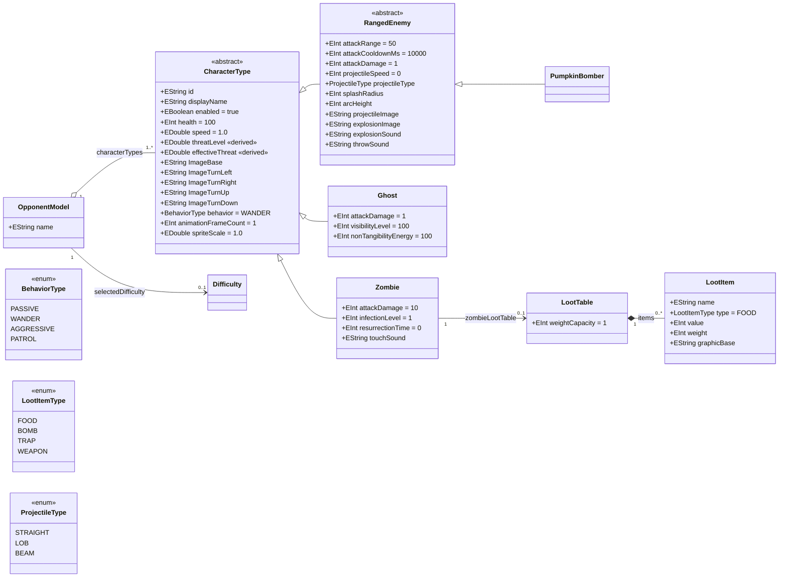
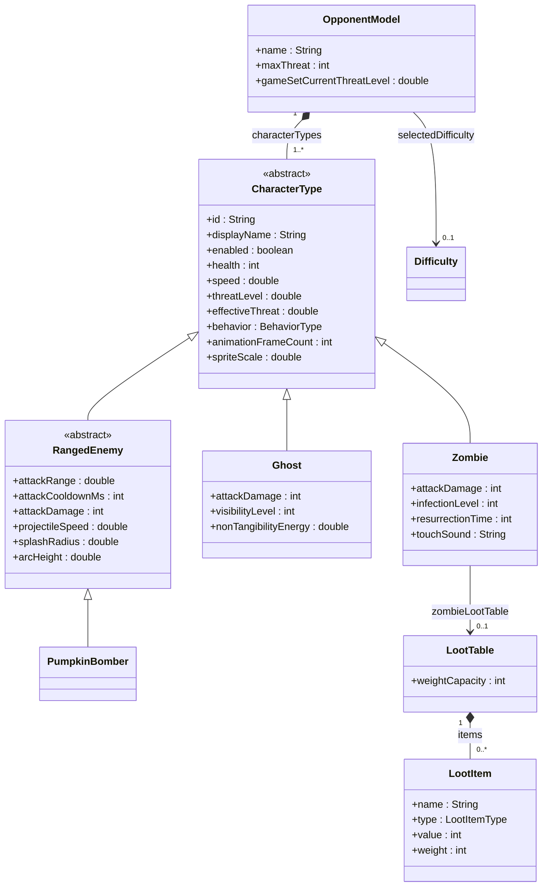

# main.game.maze.opponents

This module defines the opponents in MazeGame as model elements and runtime objects.  
Where the maze and walls describe the environment, this module describes the characters that move inside it and threaten the player.

It ties together

- the EMF model that defines opponent types and their properties  
- the generated code that exposes these definitions in Java  
- the runtime factory and helpers that create concrete opponent instances for a given difficulty and level  

---

## Responsibilities

The opponents module is responsible for

- Defining opponent types and their base stats in a model driven way  
- Providing a stable identifier and data structure for each opponent type  
- Supplying metadata used by the difficulty system, such as threat value and caps  
- Exposing a runtime factory for creating opponents with the correct configuration  
- Acting as a bridge between data (model) and logic (behaviour, difficulty, maze world)

It does not contain rendering code nor the behaviour logic itself.  
Instead it focuses on “what” an opponent is, not “how” it moves.

---

## Model Structure

### Ecore class diagram

> Constraint `validateMaxThreat`: the sum of `characterTypes.threatLevel` must
> stay at or below `selectedDifficulty.maxThreat`.

The core of the module is an EMF based model (Ecore) that describes the opponent domain.  
Typical concepts in the model include

- Opponent type  
  Each distinct enemy such as a ghost, zombie, pumpkin bomber or boss character.  
  Every type has a unique identifier for use in configuration, save games and tools.

- Base statistics  
  Values that describe the default strength of an opponent, for example  
  speed, health, damage, view range, hearing range, size or similar attributes.

- Threat contribution  
  A number that expresses how “dangerous” this type is relative to others.  
  The difficulties module uses this to calculate threat budgets and caps.

- Category or family  
  Optional grouping of opponents into families (for example melee, ranged, flying, boss)  
  that can be used in UI, analytics or higher level balancing rules.

- Behaviour hints  
  References or flags that indicate which behaviour pattern this opponent uses,  
  such as patrol oriented, chase oriented or ambush oriented behaviour.

The model is the single source of truth.  
Any change in opponent definitions should be made here, then propagated through generation.

### Mermaid overview

The opponents model imports the difficulties metamodel and uses the non-Pivot EMF OCL delegates (URI: http://www.eclipse.org/emf/2002/Ecore/OCL) for derived values and validation.

---

## Generated And Runtime Code

From the EMF model, the build generates Java representations of the opponent types.  
This usually includes

- A type or enum for opponent identifiers  
- Data classes that expose base stats and threat values in plain Java  
- Utility code for resolving model based opponents into runtime descriptions

### Generated Files in maze-module-generator

The following classes are generated from `opponents.ecore` and placed in `maze-module-generator/src-gen/main/game/maze/generated/`:

| Class | Purpose |
|-------|---------|
| `CharacterRegistrar` | Registers and looks up character types by identifier |
| `CharacterAttributeSetter` | Applies difficulty multipliers to character stats |
| `CharacterGraphicsFactory` | Provides sprite paths and animation metadata |
| `OpponentRegistry` | Lists all enemy types with their stats |

**Note**: The build uses FreeMarker templates in `maze-generator.freemarker/src/main/resources/templates/opponents/` for code generation.

**Key EMF model methods used:**
- `CharacterType.getThreatLevel()` / `setThreatLevel()` — threat contribution
- `CharacterType.getImageBase()` — base image path for sprites
- `CharacterType.getAnimationFrameCount()` / `setAnimationFrameCount()` — animation frame count
- `CharacterType.getSpriteScale()` / `setSpriteScale()` — sprite scale factor

On top of the generated code, hand written runtime code provides

- A stable API for other modules such as difficulty, behaviour and maze world  
- Conversion logic from model entities to in memory configurations  
- Default values and compatibility helpers when models evolve over time

You should not edit generated files by hand.  
Such changes will be overwritten the next time the generators run.

---

## Opponent Runtime Factory

At runtime, opponents are created through a dedicated factory or service, often called something like `OpponentsFactory` or `OpponentRuntimeFactory`.

This factory is responsible for

- Creating runtime opponent instances with the correct type, base stats and behaviour binding  
- Applying difficulty dependent scaling (through the difficulties module) to speed, health and damage  
- Ensuring that threat and cap rules are respected when instantiating enemies for a level  
- Providing convenience methods for common tasks such as “create all default opponents for this difficulty and level layout”

The goal is that game code does not need to know how stats are stored or calculated.  
It simply asks the factory for instances and uses them.

---

## Integration With Difficulties

The opponents module works closely with `main.game.maze.difficulties`.

Shared responsibilities include

- Threat values and caps  
  Each opponent type has a base threat value defined in this module.  
  The difficulties module uses those values to calculate how many of each type are allowed.

- Scaling rules  
  The difficulty module may define multipliers for speed, health and damage.  
  The opponent factory applies these multipliers when creating runtime instances.

- Composition and diversity  
  Difficulty rules may specify minimum or maximum counts for certain categories of opponents.  
  The opponent module supplies the classification and raw definitions that make these rules possible.

This separation of concerns allows you to balance difficulty without touching the core opponent definitions, and vice versa.

---

## Integration With Behaviour And Maze World

The opponents module also interacts with the behaviour and maze world modules.

- Behaviour  
  Each opponent type typically refers to a behaviour profile or behaviour key.  
  Behaviour code uses this information to attach the correct movement and decision logic to a newly created opponent.

- Maze world  
  The maze world provides the positions, paths and navigation graph that opponents use.  
  Opponent instances created by the factory are placed onto the maze world and then driven by behaviour modules.

The opponents module itself does not perform pathfinding nor collision.  
It only provides the data that other modules need to run those systems.

---

## Adding A New Opponent Type

A typical workflow for adding a new opponent type looks like this

1. Extend the EMF model  
   Add a new opponent type with unique identifier, base stats, threat value and behaviour hints.

2. Regenerate the model code  
   Run the respective generators so that the new type appears in the generated Java code.

3. Update the runtime factory  
   Teach the factory how to construct the new opponent type, including how to bind behaviour and apply difficulty scaling.

4. Update difficulty and content  
   Add threat and cap information for the new type in the difficulties module and, if needed, update any level generation rules that should use the new opponent.

5. Test in the maze  
   Create or select a level where the new opponent appears and verify that it behaves, scales and interacts correctly.

Following this sequence ensures that new opponents are introduced in a consistent model driven way.

---

## Design Guidelines

When evolving this module it is useful to follow a few guiding principles.

- Keep opponent definitions declarative  
  Opponents should be data driven.  
  Behaviour, pathfinding and other

---

## Related Documentation

| Document | Description |
|----------|-------------|
| [Technology Layman's Guide](../docs/technology-laymans-guide.md) | Simple explanation of metamodels and code generation in everyday terms |
| [Metamodel Architecture](../docs/metamodel-architecture.md) | Technical details about the Ecore metamodels |
| [FreeMarker Guide](../freemarker.readme.md) | Code generation with FreeMarker |
| [Model-Driven Code Generation Plan](../docs/mdd-code-generation.md) | Architecture for generating code from models |
| [Generated Code Module](../maze-module-generator/readme.md) | Documentation for the generated code module |
