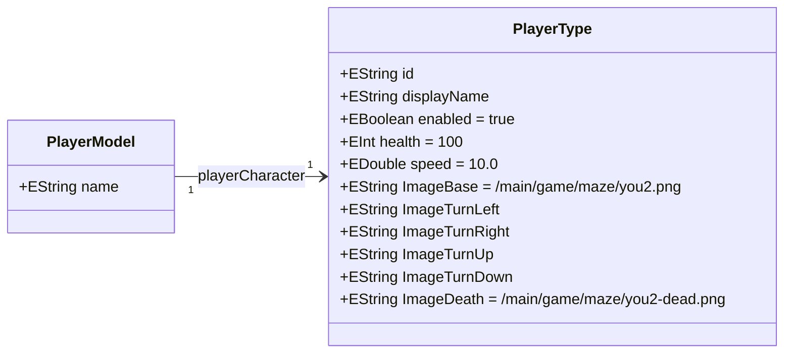

# maze

The `maze` module is the main game client for MazeGame.

It contains the executable application, user interface and game loop logic that tie together the core domain modules:

- `main.game.maze.mazeworld`  
- `main.game.maze.behaviour`  
- `main.game.maze.difficulties`  
- `main.game.maze.opponents`  
- `main.game.maze.walls`

Where those modules describe the world, enemies and rules, `maze` is responsible for actually running and rendering the game.

---

## Purpose

The `maze` module:

- starts the MazeGame application  
- builds and initialises the game world for the chosen difficulty  
- connects keyboard and other input to player actions  
- updates opponents using the behaviour module  
- renders the maze, walls, player and opponents on screen  
- orchestrates the game loop (update, render, handle events)

It is the module you run when you “play MazeGame”.

---

## Typical structure

Exact package and class names may vary, but you will usually find:

- **Application entry point**  
  A main class (for example `App`) that starts the Java runtime and initialises the JavaFX or UI toolkit.  
  This is the class you run from your IDE or via Maven.

- **Controllers**  
  One or more controller classes that handle:
  - menu and difficulty selection  
  - switching between screens (menu, game, pause, game over)  
  - coordinating between UI elements and the game state

- **Game screen / game loop**  
  A central controller for the actual game screen, responsible for:
  - creating or loading a `GameMazeWorld` instance  
  - setting up the navigation graph  
  - instantiating the player and opponents  
  - running the per-frame update and render logic

- **Rendering helpers**  
  Utility classes that know how to draw:
  - the maze grid and walls  
  - the player and opponents  
  - HUD elements such as score, lives or timers

- **Input handling**  
  Code that listens to keyboard (and possibly mouse) events and translates them into game actions:
  - move up, down, left, right  
  - pause or resume  
  - confirm menu selections

The `maze` module should not contain business rules for difficulty, walls or opponents itself; instead it uses the other modules as services.

---

## How it ties the modules together

The `maze` module acts as a coordinator:

- It asks `main.game.maze.difficulties` which difficulty is currently selected and which parameters to use.  
- It uses `main.game.maze.mazeworld` to build the maze grid, walls and navigation graph.  
- It calls into `main.game.maze.opponents` to create opponents with the correct type and base stats.  
- It uses `main.game.maze.behaviour` to drive opponent movement and decisions each update tick.  
- It uses `main.game.maze.walls` indirectly through the maze world to know which wall definitions to render and how they behave.

From the perspective of the rest of the system, `maze` is the “top level” module that glues everything together into a playable experience.

---

## Running the game

The most common ways to run the `maze` module are:

- **From an IDE**  
  - Import the full MazeGame Maven reactor.  
  - Locate the main class in the `maze` module (often named `App` or similar).  
  - Run it as a standard Java application.

- **From Maven (if configured)**  
  - In the repository root, run a full build:
    ```bash
    mvn clean verify
    ```
  - Then run the game module (for example using `exec-maven-plugin` or `javafx-maven-plugin` if present), for example:
    ```bash
    mvn -f maze/pom.xml exec:java
    ```
    or
    ```bash
    mvn -f maze/pom.xml javafx:run
    ```
  - Adjust the command to match the plugins configured in `maze/pom.xml`.

Check the `maze/pom.xml` for the exact plugin and main class configuration used in your setup.

## Start menu and viewport behavior

The JavaFX client now starts on a dedicated retro start screen (`startScreen.fxml`) where the player picks difficulty before loading the game scene.

Current runtime behavior:

- difficulty is selected from the shared `DifficultyService` model list
- chosen difficulty sets board size before game setup
- if the chosen board is larger than the screen, the stage automatically enters fullscreen
- the maze viewport now follows the player while HUD elements stay fixed on top
- the bottom command menu and score panel remain visible while the board scrolls
- start menu music and menu selection sound are optional; missing files are ignored safely
- HUD layering uses stable view ordering to avoid pulse-time child list reorder exceptions

## Shutdown behavior

The game now performs explicit shutdown cleanup when the window is closed:

- disposes the active game controller and character resources
- disposes the active audio engine and loop channels
- exits JavaFX and then terminates the JVM process

This ensures the process actually stops when closing the game window, even if background threads are still alive.

---

## Adding features to the game client

When you add new gameplay features or UI elements, the high-level rule is:

- **Data and rules** go into the domain modules  
  - new wall types → `main.game.maze.walls`  
  - new opponent types → `main.game.maze.opponents`  
  - new difficulty parameters → `main.game.maze.difficulties`  
  - new behaviours → `main.game.maze.behaviour`  
  - new world level structures → `main.game.maze.mazeworld`

- **Presentation and control** go into `maze`  
  - how the maze is drawn  
  - how menus look and behave  
  - how input is mapped to actions  
  - how the game loop is scheduled

Keeping this separation makes it easier to evolve the gameplay while keeping the client code organised.

---

## Design guidelines

When working on the `maze` module:

- keep UI and presentation logic here, and keep core rules in the domain modules  
- avoid duplicating constants or logic already defined in `main.game.maze.*`  
- make the game loop and controllers as small and composable as possible  
- prefer calling services from the other modules instead of hard coding values

By following these ideas, `maze` stays a thin, clear and maintainable game client for the MazeGame project.

---

## Player ecore model

`Player.ecore` (under `src/main/resources/xmi/player/`) and its XMI instance
`playerModel.xmi` describe the player character that the game loads at start.

### Ecore class diagram



## Graphics backend abstraction

The graphics, threading and audio facades that the game code talks to live in
a separate, backend-agnostic module so the game loop, characters and actions
can be unit tested without booting any windowing toolkit or playing real audio,
and so an alternative renderer (libGDX) can be developed alongside JavaFX.

The three sibling modules are:

| Module | Role |
|--------|------|
| [maze-common-frontend](../maze-common-frontend/readme.md) | Interfaces (`IUiScheduler`, `IAudioEngine`, `ICharacterView`) and their inert defaults (`SynchronousUiScheduler`, `NoopAudioEngine`). |
| [maze-javafx](../maze-javafx/readme.md) | JavaFX implementations (`JavaFxUiScheduler`, `JavaFxAudioEngine`, `FxCharacterView`) and `JavaFxBackend.install()`. |
| [maze-libgdx](../maze-libgdx/readme.md) | libGDX implementations (`GdxUiScheduler`, `GdxAudioEngine`, `GdxCharacterView`), `GdxBackend.install()` and `GdxAppLauncher` (WIP). |

### Bootstrap

`App.start()` calls `JavaFxBackend.install()` as its first action, which swaps
the JavaFX implementations into the `UiScheduler` and `AudioEngine` singletons
before any gameplay code touches them. Tests can call `UiScheduler.reset()` /
`AudioEngine.reset()` to drop back to the inert defaults, or `set(...)` their
own doubles.

```java
// In a test @BeforeEach
UiScheduler.set(new SynchronousUiScheduler());
AudioEngine.set(new NoopAudioEngine());

// In @AfterEach
UiScheduler.reset();
AudioEngine.reset();
```

`AudioEngine.set(...)` disposes the previous engine before swapping.

### Why this matters

- **Mockable UI thread**: `Character.moveCharacter*`, `PlayerCharacter` death
  animations and `PumpkinBomberCharacter` projectile cleanup all schedule UI
  writes via `UiScheduler.get()` instead of calling `Platform.runLater`
  directly. Tests observe state changes immediately, with no toolkit required.
- **Global audio singleton**: All sound playback in `PlayerCharacter`,
  `ZombieCharacter`, `PumpkinBomberCharacter` and `RestartGameAction` goes
  through `AudioEngine.get()`. Lifetimes and cooldowns live in one place.
- **Renderer-neutral view manipulation**: Mutations such as setLayoutX/Y,
  opacity, effect clearing and child removal go through `IUiScheduler` (and,
  where appropriate, `ICharacterView`), keeping gameplay free of direct
  JavaFX calls and making the libGDX port viable.

### Tests

- [maze-common-frontend/src/test/java/main/game/maze/common/graphics/UiSchedulerTest.java](../maze-common-frontend/src/test/java/main/game/maze/common/graphics/UiSchedulerTest.java)
- [maze-common-frontend/src/test/java/main/game/maze/common/graphics/AudioEngineTest.java](../maze-common-frontend/src/test/java/main/game/maze/common/graphics/AudioEngineTest.java)
- [maze-javafx/src/test/java/main/game/maze/javafx/JavaFxUiSchedulerTest.java](../maze-javafx/src/test/java/main/game/maze/javafx/JavaFxUiSchedulerTest.java)
- [maze-libgdx/src/test/java/main/game/maze/libgdx/GdxBackendTest.java](../maze-libgdx/src/test/java/main/game/maze/libgdx/GdxBackendTest.java)

---

## Related Documentation

| Document | Description |
|----------|-------------|
| [Technology Layman's Guide](../docs/technology-laymans-guide.md) | Simple explanation of the technologies in everyday terms |
| [Demo Guide](../demo.md) | How to demonstrate the game and its features |
| [DSL Tutorial](../docs/dsl-tutorial.md) | Creating game levels with the DSL |
| [Main README](../readme.md) | Project overview and module index |
| [Generated Code Module](../maze-module-generator/readme.md) | Documentation for the generated code |