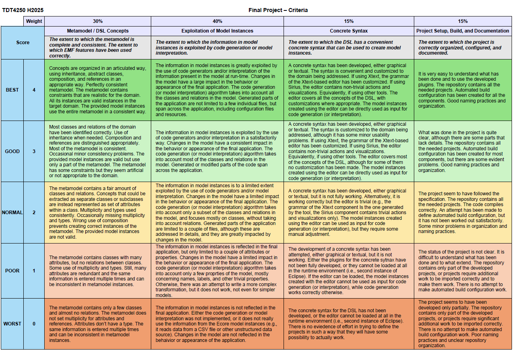

# Project Instructions
## Objective

The goal is to practice the techniques and tools covered during the semester by working on a more complex application. Please read these instructions carefully. The submission link will be available once you have joined a group.

## Groups

You have been added to Blackboard groups based on the agreed group composition. If you need to add or remove a member, contact the instructor (Leonardo). You can use the Blackboard group feature to communicate with your teammates.

## What to do

1. **Select a project.**
   Together with your group, choose one project to develop from the individual assignments submitted by group members.
   - Ideally, some proposals will be better suited than others, so selection should be straightforward. Reach out if you need help.

2. **Define a variability aspect.**
   From the selected project, choose a variability aspect to develop using model driven engineering.
   - You do not need to build new functionality from scratch. Expand and generalize what exists. Focus on behavior that can be abstracted in a model.

3. **Develop a DSL and its infrastructure.**
   Include the following:
   - An Ecore metamodel for the DSL. Instances of this metamodel (models) represent the configuration of your product or part of it.
   - Constraints in OCL or regular code to ensure model validity.
   - At least three representative model instances that demonstrate different properties. Models with identical structure and only renamed elements do not satisfy this requirement.
   - A mapping from model instances to application behavior, using one or more of these alternatives:
   - Code generation for the application (for example with Xtend or Acceleo), or parts of it. Typically you will generate or modify specific files and resources while leaving other parts unchanged. This does not mean simply generating getters and setters from Ecore models.
   - Interpretation of the model (for example with the Java APIs generated from the model) to alter application behavior based on model content.
   - Build process configuration that includes specific components, libraries, or files based on model content.
   - A concrete syntax for the DSL and an editor, either textual (for example with Xtext) or graphical (for example with Sirius).
   - Packaging configuration for the developed components as a set of Eclipse plugins.

4. **Document the work.**
   Provide documentation in the repository. It is fine to use a README.md or another format. We expect a README.md that points to the rest of the documentation in whichever format you prefer.

## Scope and focus

The aim is to gain experience with DSLs and model driven engineering on a real problem, not to deliver a complete production solution. Focus on a small but complete end to end slice, from the concrete syntax of the DSL to the generated or interpreted application, and expand from there.

## Constraints

• The generator and DSL infrastructure must be based on EMF and Ecore and related extensions.
• Alternatives may be considered if they are well justified and approved by the course staff beforehand.

 
 
 
 

# Requirements

| №  | Requirement                                                                                                                                                           | Status | Evidence from repo                                                                                                                                                                                                                                                                                                                                                                                                                   | Comment                                                                                                                                                                                                                                      |
| -- | --------------------------------------------------------------------------------------------------------------------------------------------------------------------- | :----: | -------------------------------------------------------------------------------------------------------------------------------------------------------------------------------------------------------------------------------------------------------------------------------------------------------------------------------------------------------------------------------------------------------------------------------------- | -------------------------------------------------------------------------------------------------------------------------------------------------------------------------------------------------------------------------------------------- |
| 1  | Choose the scope and variability to model                                                                                                                             |   🟢   | Variability is centered on **opponents**, **difficulties**, and **behaviour/patrol movement**. Evidence in metamodels and runtime code in `main.game.maze.opponents/`, `main.game.maze.difficulties/`, and the patrol example `maze/src/test/patrol_behavior_example.xmi`.                                                                                                                                                                               | Scope is well-defined and consistently implemented.                                                                                                                                                                                         |
| 2  | Define a DSL with an EMF Ecore metamodel                                                                                                                              |   🟢   | `main.game.maze.difficulties/src/main/resources/main.game.maze.difficulties.ecore`, `main.game.maze.behaviour/src/main/resources/movements/movements.ecore`, `main.game.maze.opponents/src/main/resources/opponents.ecore` and their `.genmodel` files.                                                                                                                                                                                                                    | Solid EMF-based DSL structure with clear separation of concerns.                                                                                                                                                                            |
| 3  | Add constraints in OCL or in code                                                                                                                                     |   🟢   | Custom validator (`@generated NOT`) in: `main.game.maze.opponents/src/main/java/main/game/maze/opponents/util/OpponentsValidator.java`. OCL delegates are enabled in tests, e.g. `ModelLoadSmokeTest.java`. Dedicated validation test: `MaxThreatValidationTest.java`.                                                                                                                                                                           | The project uses both **OCL delegates** and **custom Java validation**.                                                                                                                                                                     |
| 4  | Provide at least three representative model instances                                                                                                                 |   🟢   | Multiple clean A3-level `.xmi` models: `main.game.maze.difficulties/src/test/resources/difficultiesBasic.xmi`, `maze/src/main/resources/xmi/difficulties/difficulties.xmi`, `main.game.maze.opponents/src/main/resources/OpponentModel.xmi`, `main.game.maze.opponents/src/test/java/main/game/maze/opponents/opponentsBasic.xmi`, and the patrol movement example `maze/src/test/patrol_behavior_example.xmi`.                        | Requirement satisfied: at least three real model instances across different DSL fragments.                                                                                                          |
| 5  | Map models to application behavior by interpretation or generation or build-time configuration                                                                        |   🟡   | Runtime interpretation is used: `OpponentRuntimeFactory.java`, `DifficultyService.java`, `PatrolHelper.java`. The game loads and applies `.xmi` configurations directly at run-time.                                                                                                                                                                                                             | We must complete the behaviour model implementation un  the game                                                                                                                                                                                  |
| 6  | Define a concrete syntax and an editor using Xtext or Sirius                                                                                                          |   🔴   | No `.xtext` grammar and no Sirius `.odesign` in the repository. Only a Sirius session file (`opponents.aird`) without a corresponding viewpoint specification.                                                                                                                                                                                                                                   | A real editor is still missing. Xtext is recommended as next step (easy to map to existing Ecore).                                                                                                 |
| 7  | Package the solution as Eclipse plugins and optionally an update site                                                                                                 |   🟢   | Tycho build is present. Plugin modules use `packaging=eclipse-plugin`: `main.game.maze.difficulties`, `main.game.maze.behaviour`, `main.game.maze.opponents`, `maze-generator.acceleo-runner`. Update-site present: `maze-module-repository` with `packaging=eclipse-repository`. Feature project: `maze-feature` using `packaging=eclipse-feature`. All plugin modules contain `plugin.xml` and `MANIFEST.MF`.                                                             | Fully packaged as a valid Tycho Eclipse plugin ecosystem with feature + repository.                                                                                                                 |
| 8  | Base the solution on EMF Ecore and related extensions                                                                                                                 |   🟢   | Ecore models, generated EMF code, OCL delegates, EMF ResourceSet usage, Tycho mirror for EMF/OCL/Acceleo (`releng/mirror/pom.xml`).                                                                                                                                                                                                                                                             | Requirement fully met.                                                                                                                                                                               |
| 9  | Provide a single command build that parses models, validates them, runs tests, performs generation or interpretation, and packages plugins, failing on invalid models |   🟢   | Root `pom.xml` defines a complete Tycho reactor. Tests that load+validate models: `ModelLoadSmokeTest`, `MaxThreatValidationTest`, `DifficultiesModelSmokeTest`. GitHub Actions workflow at `.github/workflows/main.yml`. `mvn clean verify` builds mirror, plugins, feature, repository, runs tests, and fails on invalid XMI.                                                                      | The project supports a fully automated CI build verifying model correctness.                                                                                                                         |
| 10 | Ensure that all sample models load without unresolved proxies                                                                                                         |   🟢   | Tests manually register `eINSTANCE` packages, XMI factories, and load each model via `ResourceSet`. See smoke tests in opponents and difficulties modules. No unresolved proxies detected in tests.                                                                                                                                                                                               | Proxy-safety validated through test suite.                                                                                                                                                            |
| 11 | Deliver a small but complete end-to-end slice from editor to model to running application                                                                             |   🟢   | Models → runtime services → JavaFX game. The game loads `.xmi` files and changes behaviour (threat, patrols, difficulty scaling) based on them. End-to-end flow confirmed via runtime classes.                                                                                                                                                                                                    | A clean end-to-end slice is implemented using *interpretation*.                                                                                                                                      |
| 12 | Include a README that explains how to build, run, and demonstrate the result                                                                                          |   🟡   | Root `readme.md` + module-specific READMEs: `maze/readme.md`, `main.game.maze.opponents/readme.md`, `main.game.maze.difficulties/readme.md`, `main.game.maze.behaviour/readme.md`, `maze-feature/readme.md`, `maze-module-repository/readme.md`, etc.                                                                                                                                                                         | Missing review.                                                                                                  |
| 13 | Add a short demo script that shows the effect of each sample model and the behavior on validation errors                                                              |   🟡   | The `demo.md` has been created, but must be reviewed.                                                                                                                                                                                                                                                                      | Review `demo.md`.                                                               |

 
 
 
 

# Criteria:

  

  
