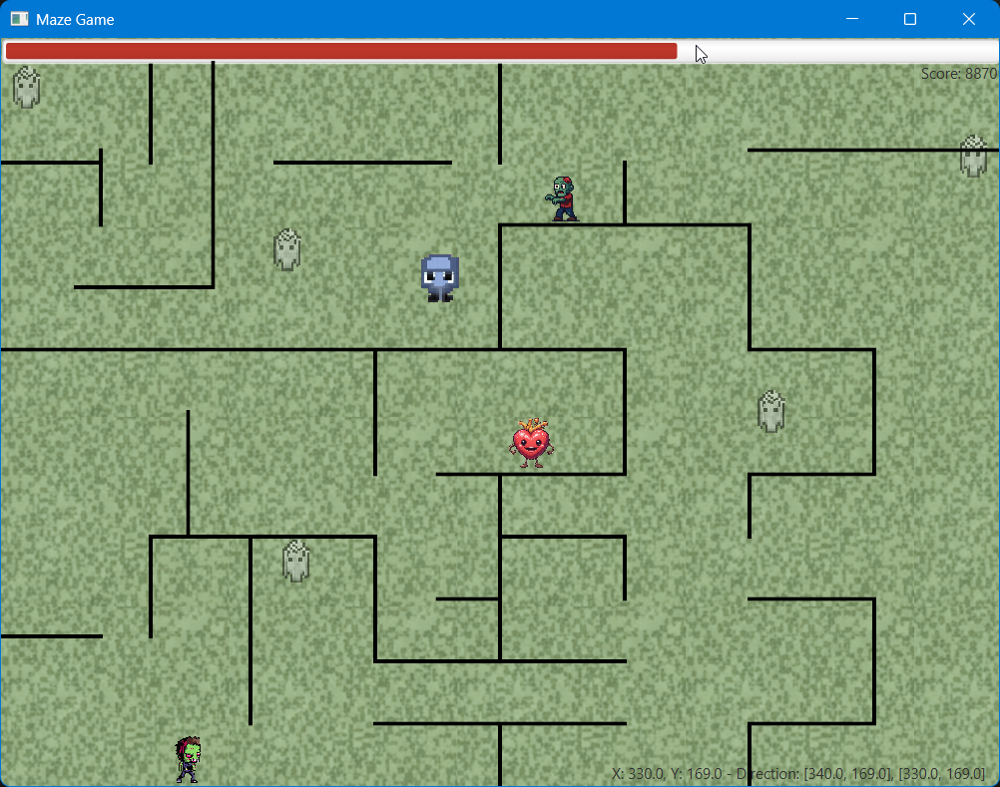
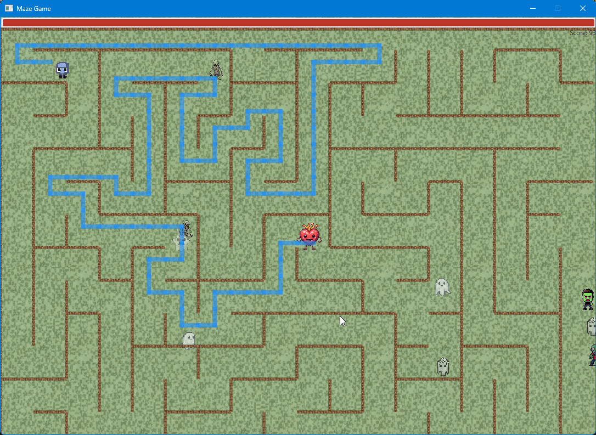
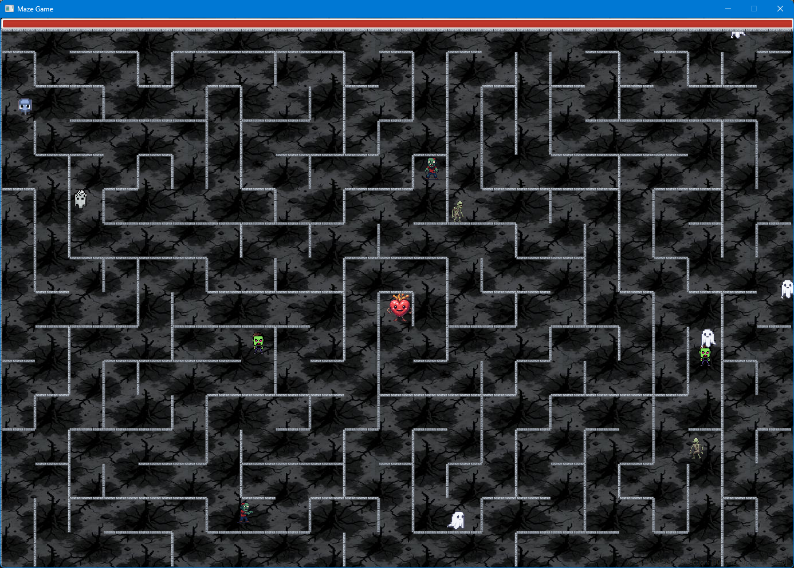

# MazeGame

## Index

* 🧩 [releng](releng/readme.md)
* 🧩 [main.game.maze.walls](main.game.maze.walls/readme.md)
* 🧩 [main.game.maze.mazeworld](main.game.maze.mazeworld/readme.md)
* 🧩 [main.game.maze.behaviour](main.game.maze.behaviour/readme.md)
* 🧩 [main.game.maze.difficulties](main.game.maze.difficulties/readme.md)
* 🧩 [main.game.maze.opponents](main.game.maze.opponents/readme.md)
* 📝 [main.game.maze.dsl](main.game.maze.dsl/readme.md) - **Xtext DSL for game configuration**
* 📝 [Xtext setup and learning guide](docs/xtext-readme.md)
* 📚 [Technology Layman's Guide](docs/technology-laymans-guide.md) - **Simple explanations of Xtext, metamodels, and FreeMarker**
* 🧩 [maze-generator.freemarker](maze-generator.freemarker/readme.md)
* 🧩 [maze-feature](maze-feature/readme.md)
* 🧩 [maze-module-repository](maze-module-repository/readme.md)
* 🧩 [maze-generator.freemarker-runner](maze-generator.freemarker-runner/readme.md)
* 🧩 [maze-module-generator](maze-module-generator/readme.md)
* 🖥️ [maze](maze/readme.md)
* 🛠️ [Build tool readme](build-tool-readme.md) - **Fast build paths and no mirror rebuild commands**

Also, see: [FreeMarker](freemarker.readme.md) in the Maze Game
Also, see: [Model-Driven Code Generation Plan](readme-mddcodegeneration.md) — architecture for generating application logic from models
Also, see Eclipse plugin setup: [Eclipse module worlds](eclipse.modules.md) in the Maze Game
Also, see Xtext setup and learning guide: [docs/xtext-readme.md](docs/xtext-readme.md)

## Project Tech stack:


 <br/>


<br/>

## Instructions

* Reach the heart with the lowest possible moves and the highest possible character life left.
* Your score will lower for each move you make and the more life you lose.
* You will get an extra 4 000 in score for reaching the heart.
* You will lose 4 000 in score for dying.
* You can press and hold the P key to see the navigation path to your win area, this will lower your score (move around a little if it doesn't work at first).
* You can press and hold the O key to see all possible navigation pathsin the game, this will lower your score (move around a little if it doesn't work at first).
* Press the H key to show high scores.
* Press the ESC key to restart the game.
* You can save your scores when you die or win.
* Try the game a few times to get to know it.

<br/>

<br/>

<br/>

<br/>

## Bugs

* The Non-player characters sometimes don't start. In such case, restart the game (use the ESC key).
* The action screens for win and game over can occasionally fail to show after adding the player flash effect. This is rare. Try restarting the game (use the ESC key).
* Sometimes when compiling and starting the game in VS Code, you will error messages stating missing projects or packages. If that is the case:  `Ctrl + Shift + P → “Java: Clean Java Language Server Workspace”`, then run: `mvn clean install` and finally run the game in VS Code, and possibly select `Continue` if VS Code says: "Build failed, do you want to continue?". Bith debugging and running without debugging will still work.
* You can pass walls by running into them through the edge.

## Missing implementations

* More music and game sounds
* Animations for die action and happy action
* Different new game actions like shooting and blowing up walls and enemies.
* Read a maze from SVG for play
* More and different levels with their own characters and setup
* Better design for high score, and let high score be affected by the difficulty setting
* A menu with instructions and game setup, including player profile settings
* Refactor score handling out of CharacterActionScreens
* Refactor code for code smells
* Implement stronger algorithms for gameplay and movement
* Replace `System.out.println` with a logger
* The application system is not very testable. Unit tests should have been written first. DI Patterns should be implemented.
* The whole Eclipse MDD model is not implemented (loot items, ranged attacks etc).

## Sources

* Background music, western game soundtracks: [https://www.youtube.com/watch?v=ccvpPJv9J3E](https://www.youtube.com/watch?v=ccvpPJv9J3E)
* Player scream sounds: [https://www.youtube.com/watch?v=3rlV-whFgXQ](https://www.youtube.com/watch?v=3rlV-whFgXQ)
* Game over sounds: [https://www.youtube.com/watch?v=bug1b0fQS8Y](https://www.youtube.com/watch?v=bug1b0fQS8Y)
* Win game music: [https://www.youtube.com/watch?v=tEFU-oqSNjE](https://www.youtube.com/watch?v=tEFU-oqSNjE)
* Vector math: [https://www.geeksforgeeks.org/check-if-two-given-line-segments-intersect/](https://www.geeksforgeeks.org/check-if-two-given-line-segments-intersect/)
* Images: [https://opengameart.org/](https://opengameart.org/)
* A lot of the graphics is generated at: [https://artlist.io/](https://artlist.io/)

## Prerequisites and setup

This project requires JDK 21 for full builds (Xtext generation + Tycho reactor).
JavaFX 25 may be used for running the game only.

* Visual Studio Code: [https://code.visualstudio.com/download](https://code.visualstudio.com/download)
  Extensions:

  * ⬇️ Extension Pack for Java (Required)
  * ⬇️ Maven for Java (Required)
  * ⬇️ Debugger for Java (Required)
  * ⬇️ Test Runner for Java (Required)
  * ⬇️ Maven Dependency Explorer (Optional)
  * ⬇️ XML by Red Hat (Optional)
  * ⬇️ OSGi for VS Code (Optional)
  * ⬇️ YAML by Red Hat (Optional)
  * ⬇️ OCL support (Optional)
  * ⬇️ Makefile Tools (Optional)

Download and install:

  * JDK 21: [https://www.oracle.com/java/technologies/downloads/#java21](https://www.oracle.com/java/technologies/downloads/#java21)
  * JavaFX 25 SDK (optional for game runtime): [https://gluonhq.com/products/javafx/](https://gluonhq.com/products/javafx/)
    Setup guide: [https://dev.java/learn/javafx/install/#javafx-windows](https://dev.java/learn/javafx/install/#javafx-windows)
  * Apache Maven: [https://maven.apache.org/install.html](https://maven.apache.org/install.html)
    - Or install [Chocolatey](https://chocolatey.org/install) and use Chocolatey to [install Maven](https://community.chocolatey.org/packages/maven) for you.
  * Powershell [Powershell 7.x](https://learn.microsoft.com/en-us/powershell/scripting/install/install-powershell-on-windows?view=powershell-7.5#msi) or higher
    - Note that Powershell can be installed on Linux and MacOs also.

Environment variables (examples on Windows):

* 🛠️ `JAVA_HOME=C:\Program Files\Java\jdk-21`
* 🛠️ `PATH_TO_FX=C:\Program Files\Java\javafx-sdk-25`
* 🛠️ `PATH+=C:\Program Files\Java\jdk-21\bin`
* 🛠️ `MAVEN_HOME=C:\Program Files\Apache\Apache Maven`
* 🛠️ `PATH+=C:\Program Files\Apache\Apache Maven\bin`

VS Code Java runtime:

* Ctrl + Shift + P → “Java: Clean Java Language Server Workspace”
* Ctrl + Shift + P → “Java: Configure Java Runtime”
* Under JDKs, add `C:\Program Files\Java\jdk-21` and set it as Default for build tasks
* If you also run the JavaFX app with newer JDK locally, keep shell builds on JDK 21
* Reload Window

⚡ Finally, in Visual Studio Code select the `App.java` file in the `maze` module and run it.

### Graphics backends (JavaFX vs libGDX)

The graphics, threading and audio facades have been extracted into three
sibling modules so the renderer can be swapped:

- [maze-common-frontend](maze-common-frontend/readme.md) — backend-agnostic
  interfaces and inert defaults used by the gameplay code.
- [maze-javafx](maze-javafx/readme.md) — the production JavaFX backend used
  by `main.game.maze.App`.
- [maze-libgdx](maze-libgdx/readme.md) — a parallel libGDX backend (WIP). The
  interface adapters are in place; the actual game loop is still being ported.

To launch either backend, use the configurations in
[.vscode/launch.json](.vscode/launch.json):

- **Launch MazeGame (JavaFX)** — runs the full game via `main.game.maze.App`.
- **Launch MazeGame (libGDX backend, WIP)** — runs
  `main.game.maze.libgdx.GdxAppLauncher`, which opens a 1024x768 LWJGL3 window
  showing placeholder status text until the game loop has been ported.

## Build commands (exact)

For a focused build command guide with fastest paths and no mirror rebuild options, see [build-tool-readme.md](build-tool-readme.md).

Xtext generation and reactor builds that include DSL modules should be run with Java 21 in the shell session.

```powershell
# PowerShell — refresh local mirror, prove key IU exists, reset Tycho cache, full build

# 1) start clean so the mirror is rebuilt
Remove-Item -Recurse -Force releng/local-p2 -ErrorAction SilentlyContinue
mvn -f releng/mirror/pom.xml -U verify

# 2) force Tycho to reread the target (clear its p2 cache)
Remove-Item -Recurse -Force "$Env:USERPROFILE\.m2\repository\.cache\tycho" -ErrorAction SilentlyContinue

# 3) full build (Tycho + app)
mvn -U clean verify
```

#### **Fast incremental run**
```bash
make build
```

#### **Mirror only, if needed**
```bash
make mirror
```

Other handy targets:

```bash
# build only the app module, then full build with tests
mvn -U -pl :main.game.maze -am clean package
mvn -U clean install

# run all unit tests
mvn test

# run unit tests only in main.game.maze.opponents
mvn -pl main.game.maze.opponents -am test

# Run the JavaFX game (Windows)
# -> Start in VSCode (CTRl + F5)
```

### Makefile usage - Windows Powershell
```
# Default: toolchain info, update mirror if needed, clear Tycho cache, full build
.\make-javafx.ps1

# Explicit target:
.\make-javafx.ps1 -Target toolchain
.\make-javafx.ps1 -Target mirror
.\make-javafx.ps1 -Target force-mirror
.\make-javafx.ps1 -Target clear-cache
.\make-javafx.ps1 -Target build

```

#### Makefile usage - Other
```bash
make force-mirror
make clear-tycho-cache
make build
```

## Debug & Build Verification

Quick reference for fast and no mirror command variants: [build-tool-readme.md](build-tool-readme.md).

Use the script `Run-P2AndBuildCheck-javafx.ps1` to run a full build with diagnostics:

```powershell
# Full build with all steps
.\Run-P2AndBuildCheck-javafx.ps1

# Skip mirror rebuild, start at build step
.\Run-P2AndBuildCheck-javafx.ps1 -StartAt 4
```

Logs are written to `releng\test-results`.

---

## Modules overview

### releng

Build and release infrastructure, including local p2 mirror, target platform, and helper scripts.  
See: [releng/readme.md](releng/readme.md)

### main.game.maze.walls

Wall types, materials, and wall registry used by mazes and rendering.  
See: [main.game.maze.walls/readme.md](main.game.maze.walls/readme.md)

### main.game.maze.mazeworld

Logical maze world with grid, cells, walls in space, navigation graph, and board size handling.  
See: [main.game.maze.mazeworld/readme.md](main.game.maze.mazeworld/readme.md)

### main.game.maze.behaviour

Movement and decision logic for actors, including behaviours and navigation helpers.  
See: [main.game.maze.behaviour/readme.md](main.game.maze.behaviour/readme.md)

### main.game.maze.difficulties

Difficulty profiles that define threat budgets, scaling, maze parameters, and player resources.  
See: [main.game.maze.difficulties/readme.md](main.game.maze.difficulties/readme.md)

### main.game.maze.opponents

Enemy types with base stats, threat values, categories, and factories for runtime opponents.  
See: [main.game.maze.opponents/readme.md](main.game.maze.opponents/readme.md)

### main.game.maze.dsl

Xtext-based Domain-Specific Language for game configuration. Provides a human-readable textual syntax for defining game levels, opponents, difficulties, patrol behaviors, and loot tables. Generates Java factory classes and XMI model instances.  
See: [main.game.maze.dsl/readme.md](main.game.maze.dsl/readme.md)  
Reference: [DSL Reference Guide](docs/dsl-reference.md) | [DSL Tutorial](docs/dsl-tutorial.md)

### maze

JavaFX game client that starts the application, runs the game loop, and renders maze and actors.  
See: [maze/readme.md](maze/readme.md)

### maze-feature

Eclipse feature that groups the MazeGame plug ins into one installable toolset.  
See: [maze-feature/readme.md](maze-feature/readme.md)

### maze-module-repository

Eclipse p2 update site that publishes the MazeGame feature for installation and targets.  
See: [maze-module-repository/readme.md](maze-module-repository/readme.md)

### maze-generator.freemarker

FreeMarker templates that turn EMF models into Java code and helper artefacts.
See: [maze-generator.freemarker/readme.md](maze-generator.freemarker/readme.md)

### maze-generator.freemarker-runner

Headless runner plug-in that executes FreeMarker-based generators during the Tycho build.
See: [maze-generator.freemarker-runner/readme.md](maze-generator.freemarker-runner/readme.md)

### maze-module-generator

Maven generator module that produces additional Java sources into `src-gen` for MazeGame.  
See: [maze-module-generator/readme.md](maze-module-generator/readme.md)


# Utility scripts at the project root

This repository includes two helper scripts for packaging the source and for running a repeatable build with diagnostics. Both scripts live in the root of the repo for easy access.

* 📦 **[pack-source.ps1](./tools/pack-source.ps1)**
* 🧪 **[Run-P2AndBuildCheck-javafx.ps1](./Run-P2AndBuildCheck-javafx.ps1)**

---

### Run-P2AndBuildCheck-javafx.ps1

**What it does**
Runs the end to end Tycho and Maven build in a controlled order, regenerates or validates the local p2 mirror, verifies required bundles (EMF, OCL, Xtext), resets Tycho cache if needed, builds modules, runs tests, and writes a single timestamped log that includes per step summaries and captured output. It also echoes the summary to the terminal at the end.

**Typical flow**

1. Optionally clears `releng\local-p2` and rebuilds the mirror.
2. Verifies required Eclipse bundles and features including Xtext SDK for DSL support.
3. Optionally clears `~\.m2\repository\.cache\tycho` to force a fresh resolve.
4. Performs a clean verify from the root with tests enabled.
5. Prints a compact result table and writes the full log under `releng\test-results`.

**Quick start**

```powershell
# From the repo root - full build
.\Run-P2AndBuildCheck-javafx.ps1

# Skip to build step only (steps 1-3 skipped)
.\Run-P2AndBuildCheck-javafx.ps1 -StartAt 4
```

**Parameters**

```powershell
# Default output folder for logs
.\Run-P2AndBuildCheck-javafx.ps1 -LogDirectory "releng\test-results"

# Start at a specific step (1=all, 2=skip mirror, 3=skip mirror+verify, 4=build only)
.\Run-P2AndBuildCheck-javafx.ps1 -StartAt 4
```

**Outputs**

* A log file named like `p2-and-build-check_yyyyMMdd_HHmmss.log` under the chosen log directory
* A terminal summary showing step name, status, and a short note
<br/>
<br/>

## Contributors
| [<br /><sub><b>Natvs</b></sub>](https://github.com/Natvs) | [<br /><sub><b>gabri-berri</b></sub>](https://github.com/gabri-berri) | [<br /><sub><b>jorgeballesta</b></sub>](https://github.com/jorgeballesta) | [<br /><sub><b>itnifl</b></sub>](https://github.com/itnifl) |
| :---: | :---: | :---: | :---: |